# Continuous discharge with randomized C-rate + SOC sweep ("const_random")

## What this experiment is

Continuous constant-current discharge (like `experiments/03_continuous_discharge_soc_sweep/`),
but instead of a fixed 0.6C rate for every battery, each battery draws its
own random C-rate (uniform 0.2C-1.0C) per variation — the continuous-protocol
counterpart to `experiments/04_pulse_variable_discharge_soc_sweep/`'s
randomized pulse rate. Combined with the standard 4-interval SOC-availability
sweep. Voltage cutoffs are LFP=1.5V / NMC=1.8V (lower than the 1.8V/2.3V used
elsewhere in the repo — a known, deliberate divergence in this experiment,
left as-is here; not re-litigated in this pass).

## Leakage-filter fix applied in this pass

`feature_engineering_const_random.py` was missing the `>=20% mutual-coverage`
filter present in every other experiment in the repo (root `feature_engineering.py`,
experiments 01/03/04/06, and the archived pulse code) — its only leakage
guard dropped bins entirely empty for *both* chemistries, not bins only one
chemistry ever reaches. This is exactly the bug documented in
`experiments/01_leakage_fix_20_percent_coverage/RESULTS.md`: a bin only one
chemistry populates gets median-imputed to a constant for the other, which a
classifier can use as a trivial giveaway instead of real dV/dQ signal. Fixed
by adding the same `coverage_by_chem`/`min_chemistry_coverage=0.2` filter
used everywhere else, with no other logic changed.

A second issue was fixed as a prerequisite for safely rerunning at all:
`sweep_const_discharge_random.py` used the identical `run_label` pattern
(`continuous_soc_<interval>`) as `experiments/03`'s own sweep, and both
write into the same `data/continuous_soc_<interval>/` folders using two
identical filenames — running the original script would have silently
overwritten experiment 03's already-published data. Changed to
`const_random_soc_<interval>` so it has its own namespace; verified
experiment 03's data is byte-for-byte unchanged after this rerun.

## SOH range aligned with experiment 03

`simulate_batteries_const_random.py` originally drew `soh = random.uniform(0.60, 0.85)`
— narrower than the `0.50-0.85` range used in experiment 03 and everywhere
else in the repo, and never simulating the most-degraded cells. Changed to
`random.uniform(0.50, 0.85)` to match experiment 03, so the two experiments
now differ only in discharge rate (fixed 0.6C vs. random 0.2C-1.0C) and
voltage cutoffs (1.8V/2.3V vs. 1.5V/1.8V), not in SOH range. Results below
are from the rerun with this wider range.

## colsample_bytree aligned with root

`ML_pipeline_const_random.py` used `colsample_bytree=1.0` for XGBoost,
diverging from root `ml_pipeline.py`'s `0.8` with no documented reason.
Changed to `0.8` to match. Rerun below is unaffected: RF and XGBoost
accuracy are identical to the pre-fix run at every interval (with this few
features, subsampling 80% vs. 100% of them per tree doesn't change the
result) — only the third-ranked feature-importance entry shifted slightly
at two intervals.

## Results (post-fix, SOH 50-85%, colsample_bytree=0.8)

| SOC Interval | RF Accuracy | XGB Accuracy | Surviving Bins | Runtime |
|---|---|---|---|---|
| 0.7-1.0 | 96.91% | 96.91% | 8 bins (`3.4-3.3` down to `2.7-2.6`) | 1.2 min |
| 0.5-0.8 | 98.96% | 98.96% | 8 bins (same range) | 1.2 min |
| 0.3-0.6 | 97.89% | 98.95% | 7 bins (`3.3-3.2` down to `2.7-2.6`) | 1.2 min |
| 0.1-0.4 | 89.47% | 90.53% | 6 bins (`3.2-3.1` down to `2.7-2.6`) | 1.2 min |

Full sweep: ~4.8 minutes. 13 of 498 solve attempts failed at every interval
(identical count and configs each time — all NMC, all
`ValueError: Q_Li=... is outside the range of possible values [...]`,
unrecovered). The failing (target Ah, SOH) combinations are the same across
all four SOC intervals, since the error occurs during cell setup before the
SOC window is ever applied; failed runs are excluded from the training data,
not imputed or worked around.

(Earlier numbers, obtained under the narrower 0.60-0.85 SOH range, were
100/100%, 99/98%, 98/99%, 97/96% for the same four intervals respectively —
uniformly a few points higher, most noticeably at the lowest SOC interval.
Widening the SOH range to include more heavily degraded cells makes the
classification task modestly harder, which is the expected, physically
sensible direction: more degradation variance means more overlap between
the two chemistries' dV/dQ signatures.)

## Plots

Three plots per SOC interval: the raw discharge curves (all runs, plus the
same data color-coded by C-rate), the extracted per-bin dV/dQ signature each
classifier actually trains on, and the evaluation panel (confusion matrix +
top-10 feature importances) for whichever model was top performer at that
interval. Plots are copies of the run's output, saved here for reference —
the source of truth is `data/const_random_soc_<interval>/`, which is
regenerated (and gitignored) on every rerun.

### SOC 0.7-1.0

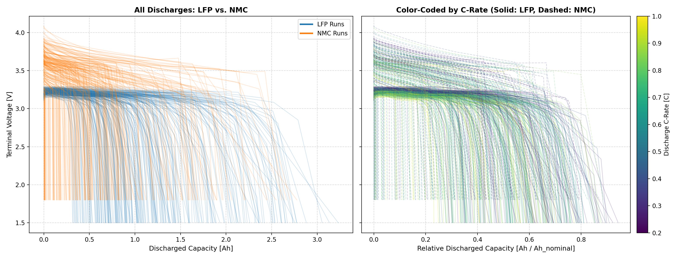
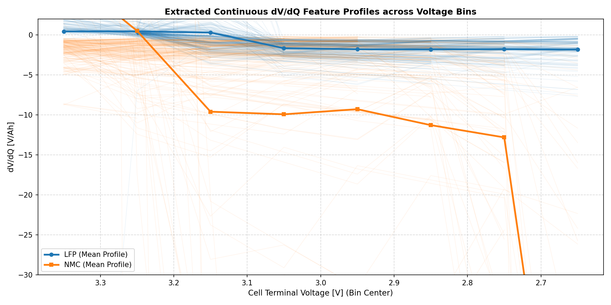
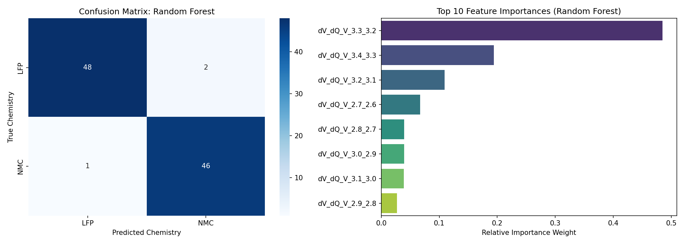

The raw curves show the expected chemistry shapes: NMC (orange) slopes
continuously from ~3.6V down to its 1.8V cutoff, while LFP (blue) sits on a
flat ~3.1-3.3V plateau before a sharp knee down to its 1.5V cutoff — visually
separable even before any feature extraction. In the dV/dQ profile, this
becomes numeric: LFP's mean profile stays near 0 V/Ah across every bin
(flat plateau → tiny voltage derivative), while NMC's mean drops sharply,
from ~0 at the 3.4-3.3V bin to below -30 V/Ah by 2.7-2.6V. Random Forest was
the top performer here (96.91%, tied with XGBoost) and put 48% of its
importance on `dV_dQ_V_3.3_3.2` alone — exactly the bin where the two mean
profiles first pull apart in the plot above. Only 3 of 95 test samples were
misclassified.

### SOC 0.5-0.8

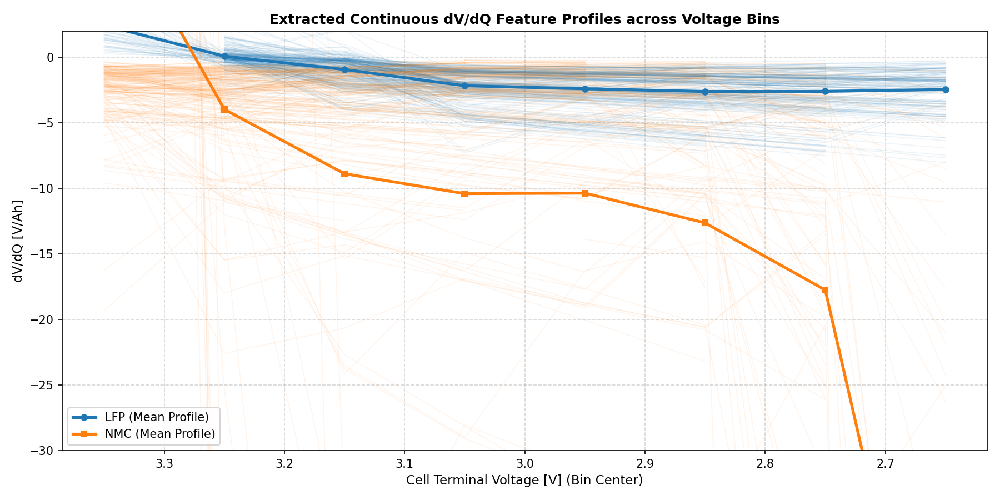
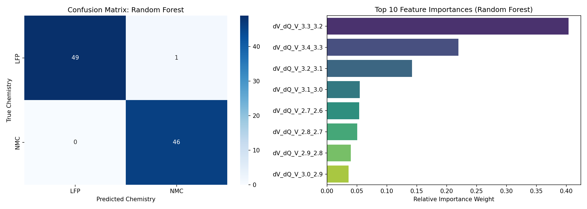

Nearly identical pattern to 0.7-1.0, and the best-performing interval
overall (98.96%). The dV/dQ separation is if anything slightly cleaner —
NMC's mean profile is already below -4 V/Ah at the first bin instead of
sitting near 0 — and Random Forest again leans on `dV_dQ_V_3.3_3.2` as the
dominant feature (41% importance). Confusion matrix shows a single
misclassified sample out of 96.

### SOC 0.3-0.6

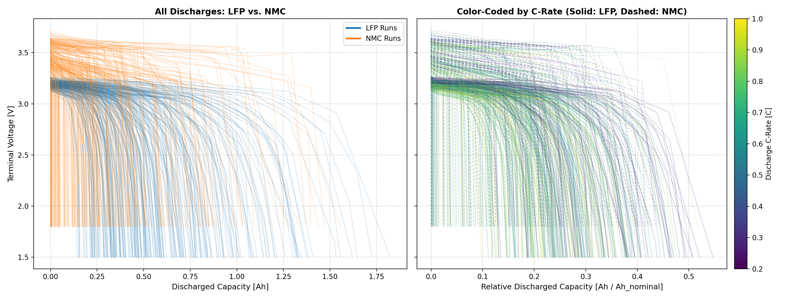
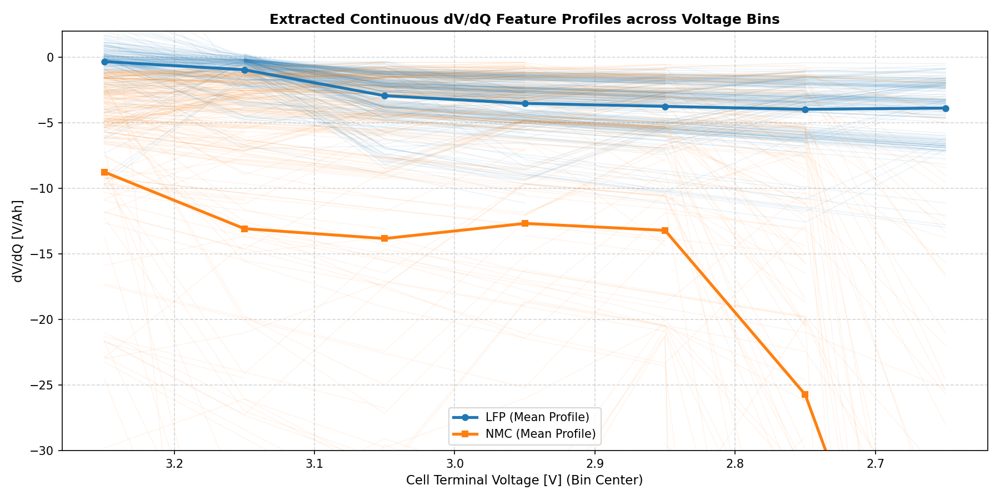
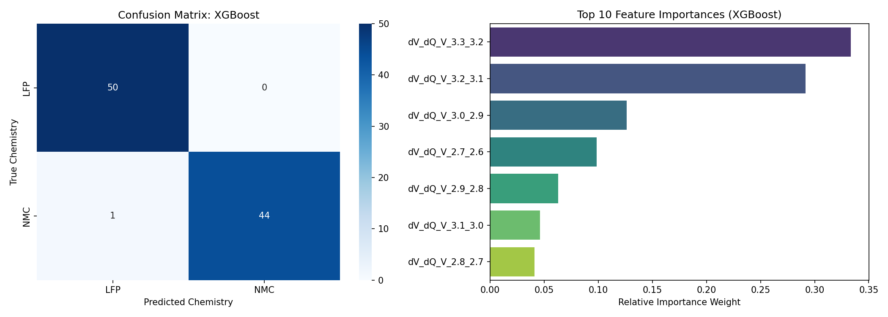

Both mean profiles shift downward relative to the higher intervals — LFP now
drifts to about -8 V/Ah by the lowest bin instead of staying near -2, and
NMC starts already around -9 V/Ah at the first bin instead of near 0. The
two profiles are still cleanly separated, just with less flat margin on the
LFP side. XGBoost edged out Random Forest here (98.95% vs. 97.89%) and its
importances are more spread out (`dV_dQ_V_3.2_3.1`, `2.7_2.6`, `3.1_3.0`,
`2.8_2.7` all contributing double digits), consistent with the coverage
filter having already dropped one bin (`3.4-3.3`, only 7 surviving) at this
interval.

### SOC 0.1-0.4

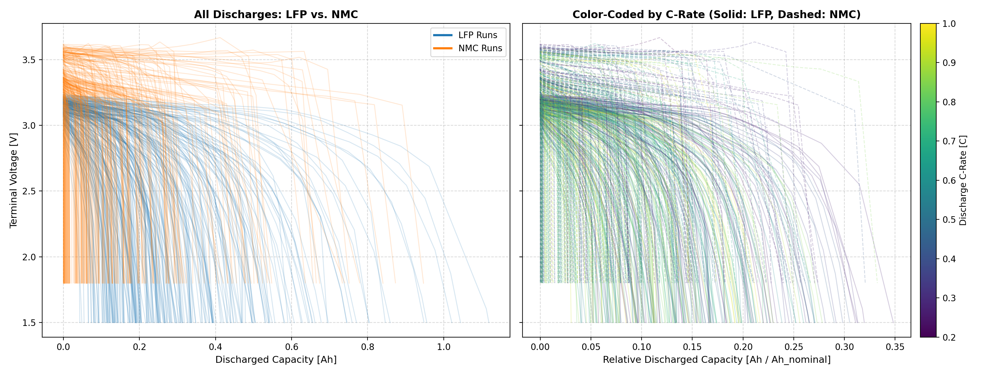
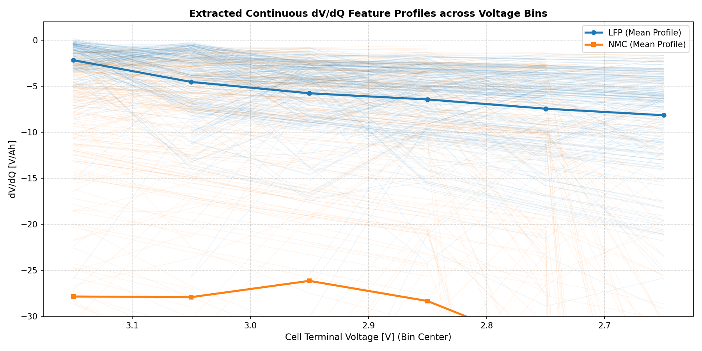
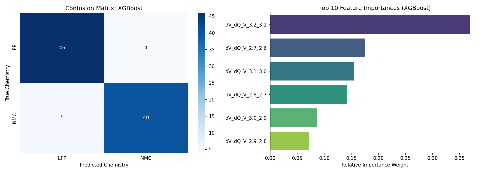

The lowest and hardest interval (90.53%). The raw discharge curves cover a
much narrower capacity range (SOC 0.1-0.4 is a smaller slice of each
battery's discharge), but the same LFP-plateau/NMC-slope shape is still
visible. In the dV/dQ plot, NMC's mean profile now sits around -28 V/Ah for
every bin instead of trending down from near 0 — this window only samples
the already-steep part of NMC's curve — and LFP has picked up a real slope
of its own, from -2 to -8 V/Ah. The two profiles are further apart in
absolute terms but the individual (faint) per-battery traces overlap more,
which shows up as the most classifier errors of the sweep: XGBoost misread
4 LFP cells as NMC and 5 NMC cells as LFP (9 of 95 test samples), also its
most balanced importance distribution (`dV_dQ_V_3.2_3.1` at 37%, five other
bins in the 7-18% range).

## Interpretation

**This holds up much better than the pulse-protocol equivalent
(`experiments/04`) did under the same kind of fix.** There, adding the
identical coverage filter to a *pulse-protocol* + randomized-discharge-rate
dataset collapsed 3 of 4 intervals to zero usable bins, and the one interval
that survived dropped from 96.9% to 81.6%. Here, every interval keeps 6-8
bins and 89-99% accuracy.

The likely reason is mechanical, not a sign the fix wasn't applied correctly
(re-verified directly: bin count on a small sample dropped from 21 to 8 with
the filter on, confirming it's active). Experiment 04's root-cause section
found that the *pulse* protocol only samples voltage once per discrete pulse
step, so higher current makes consecutive samples land farther apart in
voltage — bins get "skipped" between samples, and that skipping gets worse
as C-rate increases. **Continuous discharge doesn't have this problem**: the
PyBaMM solver samples the whole continuous trace at fine, adaptive time
resolution regardless of current, so even a fast 1.0C discharge still passes
through (and gets sampled within) every 0.1V bin along the way, not just the
bin it happens to land in between two coarse measurement points. Randomizing
C-rate on top of a continuous protocol therefore doesn't reproduce the same
sampling-resolution collapse that randomizing it on top of the pulse
protocol did.

**Caveat, not yet investigated here**: this experiment's LFP=1.5V/NMC=1.8V
cutoffs are lower than the 1.8V/2.3V used everywhere else in the repo, and
its own original code comment (now shortened, but the underlying concern
was real) warned that below 2.0V both chemistries can look nearly identical.
Several of the surviving bins here (down to `2.7-2.6V`) sit in or near that
region. Whether the strong accuracy reflects genuine chemistry separability
that low, or some other artifact specific to this cutoff choice, hasn't been
checked — flagged for the planned experiment-03-vs-05 comparison rather than
addressed in this pass.
