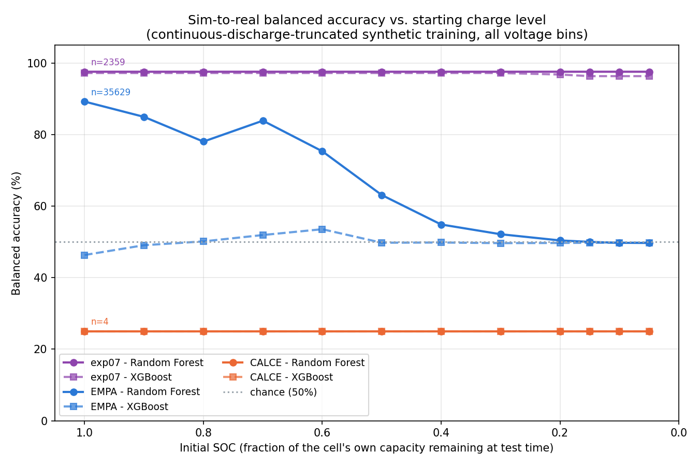

# Experiment 26: Initial_SOC sweep across three real datasets, all voltage bins

## Motivation

The project's actual end goal is sorting batteries with very little
remaining charge before recycling (Stena Recycling). This experiment
tests how sim-to-real classification accuracy holds up as the real test
window starts further from a full charge, against **three independent
real datasets** (experiment 07's original set, EMPA, CALCE), using
**every voltage bin** the leakage-preventing mutual-coverage filter lets
survive across the full 1.9&ndash;4.3V span &mdash; not the hand-picked
2.5&ndash;3.0V target zone earlier experiments restricted to.

Initial_SOC grid: `[1.0, 0.9, 0.8, 0.7, 0.6, 0.5, 0.4, 0.3, 0.2, 0.15, 0.1, 0.05]`.

## Two ways to generate low-SOC synthetic training data &mdash; and why both are needed

This experiment went through four resimulation attempts before landing on
the right methodology, and the investigation itself is as important a
result as the final numbers. **The project now has two deliberately
separate synthetic-data-generation scripts, one for each physical
scenario a "battery at low SOC" can mean:**

| | `simulate_batteries_soh_range.py` (experiment 24, unchanged) | `simulate_batteries_continuous_discharge_truncated.py` (new, this experiment) |
|---|---|---|
| Physical scenario | **Rested**: battery sat idle at low SOC, then tested cold | **Continuous**: battery has been actively discharging and has simply arrived at low SOC |
| Mechanism | `pybamm.solve(initial_soc=X)` directly, X randomized per battery | Solve ONE full discharge from near-full charge, then slice it with `truncate_at_soc()` at each target SOC point |
| Matches which real-world case | **Stena Recycling's actual production case**: end-of-life batteries arrive having sat idle for weeks/months, tested cold from a rested state | Continuously-cycled lab datasets: EMPA, experiment 07, CALCE &mdash; none of which are ever rested-then-resumed |
| Use for | The eventual production model | Validating sim-to-real accuracy against lab cycling data (this experiment) |

**Neither script is "the bug" or "the fix" in general** &mdash; they model two
different physical situations, and picking the wrong one for a given
real-world target is the actual failure mode, not a coding error in
either script. The toggle is **which script you run**, not a flag inside
one script: this project's established convention is one script per
experiment/methodology (e.g. experiment 24 vs. 21 duplicate ~90% of code
with one documented difference), which keeps each physical model's logic
simple and auditable and makes "which physics did this run use" visible
in the command itself rather than a buried, forgettable flag.
`truncate_at_soc()` itself is now factored into a shared
`soc_truncation.py` (previously duplicated identically across three
build scripts; a fourth copy would have made a future fix error-prone to
land everywhere).

## The investigation: four attempts, in order

**Attempt 1 &mdash; just lower `SOC_RANGE_MIN` to 0.05 in the rested-initialization
script.** exp07 improved substantially (fixed an honest extrapolation
gap: old training only sampled Initial_SOC 0.5&ndash;1.0, so 0.3/0.4 were never
in-distribution). **EMPA collapsed** to near-chance across most SOC
points, including at Initial_SOC=1.0 (never an extrapolation case in the
old model either) &mdash; XGBoost specifically showed the classic
"predicts NMC for everything" degenerate signature (LFP recall 0.000).

**Attempt 2 &mdash; also increase `VARIATIONS_PER_SIZE`** (83&rarr;158) to fix
suspected undersampling: widening the SOC range without adding more
battery variations meant the same 249-battery pool was spread over a
wider range, roughly halving how many batteries reached the
higher-voltage bins (confirmed directly: LFP coverage in the two
most-important bins dropped from 100% to 60&ndash;75%). **Did not fix EMPA.**
Real, measurable, but not the cause.

**Attempt 3 &mdash; also scale `T_INTERP_N_POINTS` with `initial_soc`.** Direct
inspection of low-SOC synthetic batteries found dV/dQ swinging wildly
(up to &plusmn;400, non-physical, chaotic sign flips) throughout the *entire*
trace, not settling after a few points &mdash; because a fixed 3000-point
`t_interp` pass spread across a much smaller remaining-capacity range
made each step's `dQ` tiny enough that ordinary solver-precision noise in
voltage exploded the `dV/dQ` ratio (the same mechanism as the
already-known termination artifact, but throughout the trace instead of
at one point). Scaling `T_INTERP_N_POINTS` by `initial_soc` fixed this
cleanly (confirmed: no more wild swings, smooth curves, variance back to
normal levels). **Still did not fix EMPA.** Real numerical bug, correctly
fixed, but still not the cause.

**The ablation that found the actual cause:** filtering the widened,
now-numerically-clean training set back down to `Initial_SOC>=0.5` (no
resimulation, same battery pool) and testing against EMPA at
Initial_SOC=1.0 restored **RF 99.14% / XGB 98.99%** &mdash; essentially the
original, un-widened model's performance, exactly. This is conclusive:
simply *including* any rested-initialized low-SOC synthetic battery in
training breaks EMPA's classification, independent of numerical quality
or sample count. The reason: `initial_soc=X` initializes a **rested**,
uniform-concentration battery state. A real cell that has been actively
discharging and has arrived at the same nominal SOC carries concentration
polarization a freshly-"rested" cell doesn't have &mdash; a different
physical state with different terminal-voltage behavior, even at
identical SOC. Every real dataset here is continuously-cycled, never
rested-then-resumed, so every added rested-low-SOC synthetic battery
represented a scenario none of the real data actually matches.

**Attempt 4 (final) &mdash; switch to continuous-discharge-then-truncate.**
Described above. Confirmed clean on inspection: smooth, monotonically
decreasing voltage, no wild swings, sensible dV/dQ magnitudes even at the
deepest truncation (Initial_SOC=0.05).

## Final results

### Experiment 07 (4 physical cells: 1 LFP + 3 NMC, 2359 real cycles)

7 bins survived: `3.2-3.1` through `2.6-2.5`. **Excellent and remarkably
stable across the entire grid** &mdash; both models barely move.

| Initial_SOC | RF raw | RF balanced | RF LFP rec | RF NMC rec | XGB raw | XGB balanced | XGB LFP rec | XGB NMC rec |
|---|---|---|---|---|---|---|---|---|
| 1.0 | 96.95% | 97.57% | 0.988 | 0.964 | 96.31% | 97.21% | 0.990 | 0.955 |
| 0.9 | 96.95% | 97.57% | 0.988 | 0.964 | 96.31% | 97.21% | 0.990 | 0.955 |
| 0.8 | 96.95% | 97.57% | 0.988 | 0.964 | 96.31% | 97.21% | 0.990 | 0.955 |
| 0.7 | 96.95% | 97.57% | 0.988 | 0.964 | 96.31% | 97.21% | 0.990 | 0.955 |
| 0.6 | 96.95% | 97.57% | 0.988 | 0.964 | 96.31% | 97.21% | 0.990 | 0.955 |
| 0.5 | 96.95% | 97.57% | 0.988 | 0.964 | 96.31% | 97.21% | 0.990 | 0.955 |
| 0.4 | 96.95% | 97.57% | 0.988 | 0.964 | 96.31% | 97.21% | 0.990 | 0.955 |
| 0.3 | 96.95% | 97.57% | 0.988 | 0.964 | 96.31% | 97.21% | 0.990 | 0.955 |
| 0.2 | 96.95% | 97.57% | 0.988 | 0.964 | 95.68% | 96.79% | 0.990 | 0.946 |
| 0.15 | 96.95% | 97.57% | 0.988 | 0.964 | 95.00% | 96.34% | 0.990 | 0.937 |
| 0.1 | 96.95% | 97.57% | 0.988 | 0.964 | 95.00% | 96.34% | 0.990 | 0.937 |
| 0.05 | 96.95% | 97.57% | 0.988 | 0.964 | 95.00% | 96.34% | 0.990 | 0.937 |

### EMPA (199 physical cells: 32 LFP + 167 NMC, 35,629 real cycles)

8 bins survived: `3.3-3.2` through `2.6-2.5`. **Random Forest shows
exactly the expected smooth degradation as the test window moves toward
full depletion. XGBoost does not work for this task at all &mdash; stuck at
or near chance across the entire grid, including at full charge.**

| Initial_SOC | RF raw | RF balanced | RF LFP rec | RF NMC rec | XGB raw | XGB balanced | XGB LFP rec | XGB NMC rec |
|---|---|---|---|---|---|---|---|---|
| 1.0 | 95.59% | **89.23%** | 0.796 | 0.988 | 75.55% | 46.33% | 0.022 | 0.904 |
| 0.9 | 94.30% | 84.95% | 0.708 | 0.991 | 78.48% | 49.07% | 0.047 | 0.934 |
| 0.8 | 92.10% | 78.04% | 0.568 | 0.992 | 79.91% | 50.14% | 0.052 | 0.950 |
| 0.7 | 94.17% | 83.89% | 0.684 | 0.994 | 81.50% | 51.92% | 0.073 | 0.965 |
| 0.6 | 91.34% | 75.33% | 0.512 | 0.995 | 83.63% | 53.54% | 0.082 | 0.989 |
| 0.5 | 87.29% | 63.11% | 0.266 | 0.996 | 82.47% | 49.76% | 0.004 | 0.991 |
| 0.4 | 84.53% | 54.86% | 0.101 | 0.996 | 82.56% | 49.82% | 0.004 | 0.992 |
| 0.3 | 83.61% | 52.14% | 0.047 | 0.996 | 82.57% | 49.66% | 0.000 | 0.993 |
| 0.2 | 83.08% | 50.41% | 0.011 | 0.997 | 82.65% | 49.71% | 0.000 | 0.994 |
| 0.15 | 82.95% | 50.00% | 0.003 | 0.997 | 82.72% | 49.75% | 0.000 | 0.995 |
| 0.1 | 82.72% | 49.74% | 0.000 | 0.995 | 82.77% | 49.77% | 0.000 | 0.995 |
| 0.05 | 82.64% | 49.70% | 0.000 | 0.994 | 82.78% | 49.78% | 0.000 | 0.996 |

### CALCE (4 physical cells: 2 LFP + 2 NMC)

14 bins survived (full 1.9&ndash;4.3V span). Flat at **25.00% balanced
accuracy** for both models at every SOC point &mdash; a spot-check, not
evidence of anything about SOC dependence. Per-sample: both LFP cells
misclassified as NMC (as in experiment 25), and one of the two NMC cells
(`SP20-3`, which per experiment 25's own finding never discharges below
3.49V and so has **zero real coverage in any surviving bin** &mdash; every
one of its features is entirely median-imputed) now also misclassifies
as LFP, where it previously didn't. This is exactly the fragility already
documented for this dataset: a single always-imputed, zero-information
sample's prediction is essentially a coin flip on wherever the training
median happens to fall, and one flip out of 4 samples is a 25-point swing
by construction. Not a new finding about SOC or about this experiment's
methodology &mdash; a restatement of why CALCE was never usable as
generalization evidence in the first place.

## Plot

Balanced accuracy (y) vs. Initial SOC (x, descending: full charge on the
left, near-empty on the right), RF (solid) and XGBoost (dashed) per
dataset, chance (50%) marked. No extrapolation shading &mdash; every point on
this grid is in-distribution for the continuous-discharge-truncated
training set, unlike the earlier rested-initialization attempts.

## Conclusions

1. **Random Forest is the model to use for this task.** Its EMPA curve is
   exactly the shape a genuinely working, honestly-calibrated classifier
   should produce: high accuracy at full charge (89.23%), smoothly
   declining as the real cell's remaining information shrinks, settling
   toward chance only once there's genuinely very little discharge curve
   left to read (Initial_SOC &le; 0.15). exp07 stays excellent throughout.
2. **XGBoost is not fit for this task, full stop** &mdash; not just at low
   SOC. It never exceeds ~54% balanced accuracy on EMPA anywhere in the
   grid, including at full charge, where the equivalent single-SOH-point
   model (experiment 24) scored 99.15%. This is consistent with a pattern
   across this entire project: XGBoost has repeatedly proven far less
   robust than RF to any training distribution that spans multiple
   conditions at once (SOH range, now pooled multi-SOC training) rather
   than a single calibration point. Not chased down further this
   experiment (decision: accept RF's result, document this limitation
   rather than keep resimulating) &mdash; a plausible but unconfirmed
   explanation is that training one model across all 12 pooled SOC-
   truncated variants dilutes precision at any single SOC point relative
   to a model specialized for that point alone (the ablation test's
   99.14%/98.99% trained on Initial_SOC>=0.5 only, not the full 0.05-1.0
   pool), and XGBoost's sequential boosting appears far more sensitive to
   that dilution than RF's bagged averaging.
3. **The methodology fix (continuous-discharge-truncation) is validated**:
   RF's smooth, monotonic-ish degradation curve, and exp07's continued
   excellence, are the qualitative signature of correct physics &mdash; a
   sharp contrast with every rested-initialization attempt's erratic,
   non-monotonic collapse.

## Caveats, stated plainly

- **CALCE (n=4) is a spot-check, not generalization evidence** &mdash; at
  every SOC point, for either training methodology this experiment
  tried. Do not read the flat 25% line as a finding about SOC; read it as
  confirmation this dataset can't support one.
- **Experiment 07 has a documented device-confound history**
  (`experiments/07_real_lfp_nmc_test/01_real_vs_real_device_confound/RESULTS.md`):
  only 1 LFP cell vs. 3 NMC cells, so chemistry label is entangled with
  device/lab identity in that dataset. Mitigated, not eliminated, here:
  this experiment only ever uses experiment 07 as a held-out real test
  set for a model trained purely on synthetic data, which never sees
  this dataset's device fingerprint during training.
- **Experiment 07's SOH is not filtered**, unlike EMPA and CALCE &mdash; a
  real inconsistency in how the three datasets are selected, kept as-is
  to match how every prior experiment used this dataset.
- **EMPA (199 independent physical cells) remains the only one of the
  three with enough independent cells to support a real generalization
  claim.** exp07's stability is a valuable independent corroboration that
  RF's approach is sound, but exp07's own numbers (fewer cells, a
  device-confound history) carry less weight than EMPA's.
- **This experiment's synthetic training data is NOT the production
  dataset.** It was built specifically to match continuously-cycled lab
  data for validation purposes. Generating the actual Stena production
  model requires `simulate_batteries_soh_range.py` (rested
  initialization) &mdash; see the toggle table above. Do not reuse
  `data/26_soh_range_continuous_discharge_truncated_v1/` for production.
- **All-voltage-bins does not mean LFP's ~3.5V physical ceiling
  disappeared** &mdash; every surviving-bin set here still sits at or below
  ~3.3V, consistent with every prior experiment's finding that this is
  real electrochemistry, not a filter artifact.
