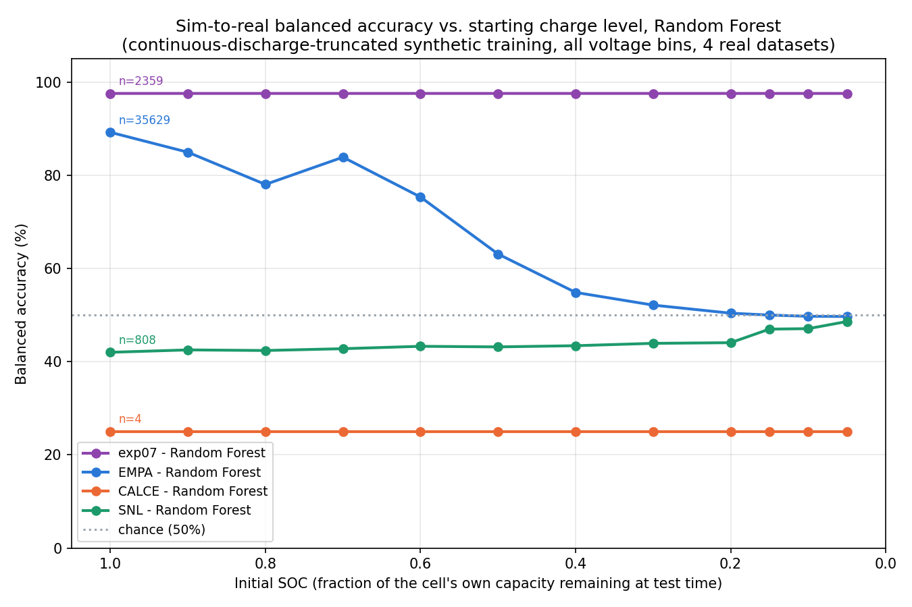

# Experiment 27: Initial_SOC sweep extended to SNL, a 4th real dataset (Random Forest only)

## Motivation

Extends experiment 26's Initial_SOC sweep (exp07/EMPA/CALCE) to a 4th,
genuinely independent real dataset: the SNL (Sandia National Labs) 18650
cylindrical cell dataset. **Random Forest only** &mdash; experiment 26 already
established XGBoost never exceeds ~54% balanced accuracy against EMPA
anywhere in this SOC grid; that dead end isn't repeated here.

Initial_SOC grid: `[1.0, 0.9, 0.8, 0.7, 0.6, 0.5, 0.4, 0.3, 0.2, 0.15, 0.1, 0.05]`,
identical to experiment 26.

## The dataset

`DownloadedData/SNL data/SNL LFP/` (21 cells) and `SNL NMC/` (22 cells) &mdash;
**43 independent physical cells total**, both a larger count and a more
chemistry-balanced split than any other real dataset in this project
(EMPA: 199 cells but coin-cell scale; exp07: 4 cells, 1 LFP vs. 3 NMC;
CALCE: 4 cells). Only the `0-100` (full SOC range) files are usable for a
sweep down to Initial_SOC=0.05 &mdash; the `20-80`/`40-60` files are
partial-SOC-window aging protocols that never traverse below their window
floor by design, so they're excluded.

Like EMPA/exp07/CALCE, SNL is continuously-cycled lab data (never
rested-then-resumed), so **no resimulation was needed**: the existing
continuous-discharge-truncated synthetic training set
(`data/26_soh_range_continuous_discharge_truncated_v1/`) applies directly
&mdash; see experiment 26's RESULTS.md and the rested-vs-continuous-discharge
project memory for why that distinction matters.

## Two real data-quality issues found and fixed while building this dataset

Unlike EMPA/exp07/CALCE, SNL's cells run into the thousands of cycles each
with significant capacity fade, exposing two new problems this project
hadn't hit before.

**1. A periodic doubled-capacity logging artifact.** SNL's cycle data
contains a recurring cycle (roughly every ~500 cycles, confirmed present
in all 43 files, always landing within the first 10 cycles too) whose
`Discharge_Capacity (Ah)` is exactly ~2x every other cycle's &mdash; almost
certainly a reference-performance-test cycle logged under a single
`Cycle_Index`. The BOL-from-first-10-cycles convention this project uses
for EMPA/CALCE takes the **max** capacity in that window deliberately, to
catch a real formation-capacity peak &mdash; but that same choice locks BOL
onto this artifact 100% of the time here, since it always falls in the
window. This silently doubled every cell's computed BOL, corrupting every
cycle's SOH and producing a near-chance first attempt at this experiment
that traced back to this single line. **Fix: use the median of the first
10 cycles instead of the max** &mdash; robust to the single outlier, and it
has the side effect of automatically excluding the artifact cycles from
the main SOH filter too (their SOH computes to ~2.0, outside the [0.8,1.0]
target range), so no separate special-casing was needed.

**2. Fixed-time (not fixed-capacity) raw sampling under-resolves LFP's
end-of-discharge knee.** SNL's raw timeseries isn't logged at a constant
time interval &mdash; higher-current cycles log far less densely in time
(confirmed: one LFP cycle had only 29 raw discharge samples total, ~120s
apart, vs. ~700 samples ~10s apart for a lower-rate cycle). LFP's terminal
voltage collapse is almost a step function in capacity space; at coarse
sampling this collapse can land inside 1-2 raw samples, each spanning
several 0.1V bins at once. Since `feature_engineering.py` bins
point-to-point dV/dQ by a sample's *ending* voltage, one such sample dumps
one huge dV/dQ value into whichever bin it lands in while the bins it
jumped over get zero real coverage. **Fix: resample each truncated segment
onto an 80-point evenly-spaced capacity grid** (`resample_on_capacity()`,
copied from EMPA's build script, which needed it for the same class of
reason) before feature extraction.

Both fixes are in `build_real_snl_soc_sweep.py`; **subsampling** was also
added (`MAX_CYCLES_PER_CELL=20`, evenly spaced across each cell's
qualifying lifetime) purely for tractability &mdash; with the corrected BOL,
nearly every cycle across a cell's multi-thousand-cycle life falls in
SOH [0.8,1.0] (slow fade), which without a cap would have produced ~15M
rows, dwarfing every other dataset in this project.

## Result: SNL does not classify well, and the reason is now understood

Neither fix above changed the outcome. **SNL sits at or below chance
(42-48% balanced accuracy) across the entire SOC grid**, with a clear,
consistent, non-degenerate-looking failure signature: LFP recall is
essentially 0.000 everywhere (real LFP cells are almost always predicted
as NMC), while NMC recall stays high (0.82-0.96).

Diagnosis (not a coding bug &mdash; verified against a possible chemistry-label
mixup: real LFP voltage tops out at 3.505V and real NMC at 4.141V, exactly
as expected for each chemistry): the trained model's feature importances
are dominated by the two deepest-discharge surviving bins
(`dV_dQ_V_2.7_2.6`, `dV_dQ_V_2.6_2.5` &mdash; together ~49% of total
importance). In the **synthetic** training data (calibrated in experiments
20/21 against exp07's real cells, validated on EMPA), NMC's dV/dQ
magnitude is far steeper than LFP's in this region &mdash; that gap is the
main signal the classifier learned. In SNL's **real** cells specifically,
LFP's own end-of-discharge knee is comparably steep in that same region
(sometimes steeper than SNL's own real NMC there) &mdash; a real electrode/
cell-design difference between SNL's specific 18650 LFP cells and the
cells the PyBaMM parameter calibration was fit against, not a synthetic
data or feature-extraction bug. The classifier reads SNL's real LFP knee
as "NMC-shaped" because that is exactly the signature it was trained to
associate with NMC.

## Final results (Random Forest, balanced accuracy)

| Initial_SOC | exp07 | EMPA | CALCE | SNL |
|---|---|---|---|---|
| 1.0 | 97.57% | 89.23% | 25.00% | 42.01% |
| 0.9 | 97.57% | 84.95% | 25.00% | 42.53% |
| 0.8 | 97.57% | 78.04% | 25.00% | 42.40% |
| 0.7 | 97.57% | 83.89% | 25.00% | 42.78% |
| 0.6 | 97.57% | 75.33% | 25.00% | 43.30% |
| 0.5 | 97.57% | 63.11% | 25.00% | 43.17% |
| 0.4 | 97.57% | 54.86% | 25.00% | 43.43% |
| 0.3 | 97.57% | 52.14% | 25.00% | 43.93% |
| 0.2 | 97.57% | 50.41% | 25.00% | 44.07% |
| 0.15 | 97.57% | 50.00% | 25.00% | 46.99% |
| 0.1 | 97.57% | 49.74% | 25.00% | 47.08% |
| 0.05 | 97.57% | 49.70% | 25.00% | 48.62% |

exp07/EMPA/CALCE numbers are experiment 26's own (unchanged; reused
directly, not re-run &mdash; nothing about their own pipeline changed here).
SNL numbers were re-run after [[exp31_snl_lead_in_artifact_fix]] (a
discharge-parsing bug fixed via experiment 31's plots); the fix moved
every figure by less than 1.1 points, consistent with that fix's own
finding that it doesn't meaningfully affect reported accuracy.

## Plot

Random Forest balanced accuracy (y) vs. Initial SOC (x, descending: full
charge on the left, near-empty on the right), chance (50%) marked, all
four datasets. SNL sits just below chance across the whole grid, trending
slowly *upward* toward chance as Initial_SOC drops &mdash; consistent with the
knee-region bins (which drive the misclassification) mattering less once
the real test window is truncated to a smaller fraction of the discharge
that more rarely reaches that deep-discharge region at all.

## Conclusions

1. **SNL is a genuine sim-to-real generalization failure, mechanistically
   understood, not a data-pipeline bug.** Two real, previously-undocumented
   SNL-specific data-quality issues (the doubled-capacity BOL artifact and
   the fixed-time-sampling knee-resolution problem) were found and fixed;
   neither was the cause of the classification failure, and both fixes are
   kept because they are independently correct.
2. **This is a real limitation of the current calibration, worth stating
   plainly rather than chased further this experiment** (matching
   experiment 26's decision to accept and document XGBoost's failure
   rather than keep resimulating): the PyBaMM parameter calibration
   (experiments 20/21, fit against exp07's real cells) captures exp07's
   and EMPA's LFP/NMC dV/dQ contrast well, but SNL's specific 18650 LFP
   cells have a comparably steep end-of-discharge knee to their own NMC
   counterparts &mdash; a cell-design/electrode difference the calibration
   doesn't currently capture.
3. **exp07 and EMPA's results stand as this project's strongest evidence
   that the pipeline works when cell chemistry matches the calibration.**
   Adding a 4th, larger, more chemistry-balanced dataset that fails for an
   understood, specific, non-bug reason is more informative than adding
   one that happened to succeed for reasons that wouldn't be understood
   either way.

## Caveats, stated plainly

- **This does not reopen or contradict experiment 26's RF conclusion.**
  exp07 and EMPA (89.23% and 97.57% at full charge respectively) remain
  unchanged and are the datasets the pipeline was calibrated against or
  validated on.
- **SNL's failure is not evidence the whole approach is broken** &mdash; it's
  evidence the current PyBaMM calibration is specific to the LFP/NMC cell
  designs it was fit against (exp07's cells), and doesn't automatically
  transfer to every LFP/NMC cell on the market. Extending the calibration
  to cover SNL's cells specifically (e.g., re-tuning the LFP OCP tail
  parameter against SNL's own knee shape) was not attempted here &mdash; a
  natural next step if this dataset needs to be supported, but out of
  scope for this experiment's RF-only, no-resimulation mandate.
- **This dataset's SOH-filtered, subsampled real set (`MAX_CYCLES_PER_CELL=20`)
  is a deliberate sampling choice for tractability, not the dataset's full
  size** &mdash; with the corrected BOL, the true SOH-in-range cycle count per
  cell often runs into the thousands.
- **All-voltage-bins does not mean LFP's ~3.5V physical ceiling
  disappeared** &mdash; SNL's own real LFP voltage tops out at 3.505V, NMC at
  4.141V, consistent with every prior experiment's finding that this is
  real electrochemistry.
