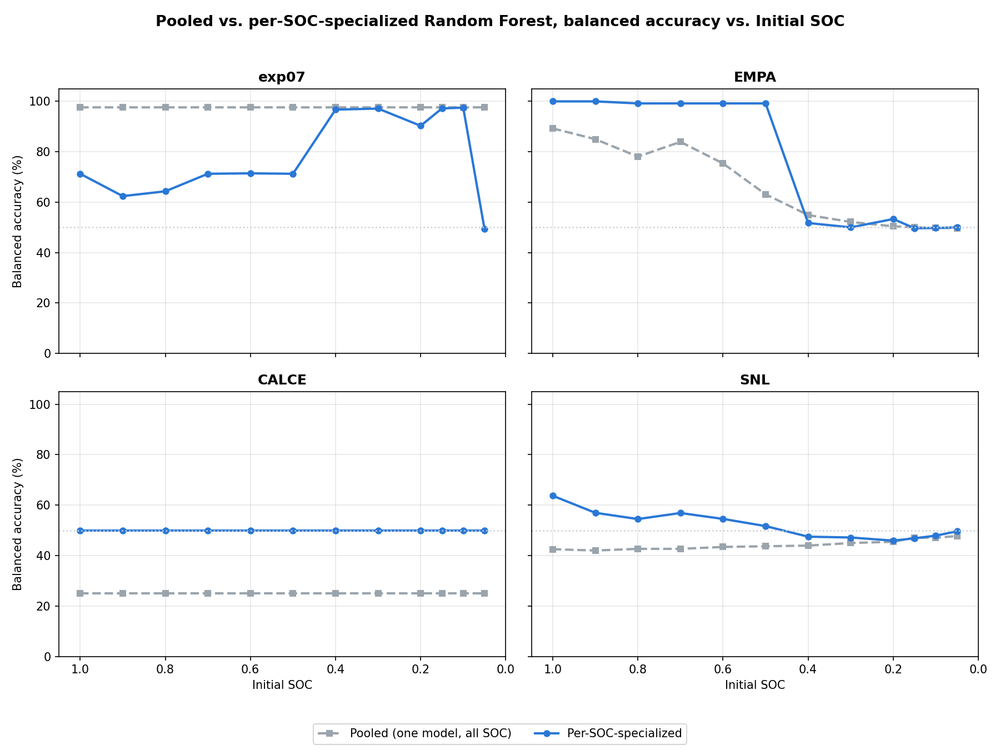

# Experiment 28: per-SOC-point specialized Random Forest models

## Motivation

Experiments 26/27 train **one Random Forest per real dataset**, pooling
synthetic training rows from **all 12 Initial_SOC truncation points**
together. That pooling was identified as the reason EMPA's accuracy
declines gradually starting almost immediately (already dropping by
Initial_SOC=0.9-0.8): higher-voltage bins survive the pooled
mutual-coverage filter only because the pool includes plenty of
full-charge batteries, but a single real battery truncated to a low SOC
often has zero real coverage there -- so that feature goes entirely
median-imputed for it, measurably biasing the model (LFP recall drifting
toward 0 as SOC drops -- a "predict NMC for everything" pattern).

This experiment tests the fix: train a **separate** Random Forest for
each Initial_SOC point, so each model's synthetic training data is
truncated to the *same* degree as the real batteries it's evaluated
against. `feature_engineering.py`'s existing >=20%-mutual-coverage filter
then decides, per SOC point, which bins both chemistries actually still
reach -- no hand-picked voltage range, no resimulation, no rested-init
training (which would reproduce experiment 26's own "Attempt 1" collapse
for an unrelated reason -- confirmed with the user before building this).

## Result: genuinely mixed, not a clean win

**EMPA (199 cells): big improvement at high-mid SOC, sharp new cliff at
low SOC.** Specialized models hold ~99-100% balanced accuracy from
Initial_SOC=1.0 down to 0.5 (vs. pooled's declining 89%→63% over that
same range) -- exactly the fix intended. But at Initial_SOC=0.4 the
surviving bin set **changes composition** (drops `dV_dQ_V_3.3_3.2`, gains
`dV_dQ_V_2.6_2.5`) and accuracy **collapses in one step** to 51.72%
(LFP recall 0.035) and stays near chance through 0.05. `dV_dQ_V_2.6_2.5`
is a bin experiment 24 already flagged as borderline (it fell below the
20% mutual-coverage threshold once combined with the full real-cycle
population there) -- here, isolated to a single SOC point with only 498
synthetic batteries to calibrate it, it's evidently not reliable enough to
carry the split alone. Net effect: a step function (excellent, then
chance) instead of the pooled model's smooth decline -- better in the
upper half of the grid, no better (arguably worse, since there's no
gradual warning) in the lower half.

**exp07 (4 cells): worse at full charge, matches pooled in the middle,
worse again at the very bottom.** At Initial_SOC=1.0-0.5 the specialized
models score only 62-71% (vs. pooled's flat 97.57%) because two
additional near-full-charge bins (`dV_dQ_V_3.4_3.3`, `dV_dQ_V_3.3_3.2`)
now survive that the pooled model's cross-SOC coverage averaging had
excluded. Real coverage there is high (98.7%) -- not sparse -- but real
exp07 LFP's dV/dQ magnitude in `dV_dQ_V_3.4_3.3` (median -26.37) is over
5x more extreme than synthetic LFP's own value there (-5.43); every real
LFP sample gets clipped to the same synthetic-derived boundary, and the
model (calibrated only on synthetic) ends up weighting this bin heavily
(23.4% feature importance) even though it doesn't reflect a real,
calibrated relationship. At Initial_SOC=0.4 through 0.1, once those two
bins drop out and the surviving set matches the pooled model's own
7-bin/6-bin/5-bin zone almost exactly, accuracy recovers to 90-97%,
matching pooled closely. At Initial_SOC=0.05 it collapses again (49.30%)
once the set narrows to only 4 bins.

**CALCE (4 cells): flat 50% at every point**, vs. pooled's flat 25%. Still
just a spot-check (n=4) -- now both real LFP cells are consistently
misclassified as NMC (LFP recall 0.000, NMC recall 1.000) at every SOC
point, a more stable-looking pattern than the pooled model's occasional
NMC misclassification, but not meaningfully more informative given the
sample size.

**SNL (43 cells): modest improvement at high SOC, converges to the same
chance floor at low SOC.** 63.72% at Initial_SOC=1.0 (vs. pooled's
42.52%), declining to the same ~46-50% floor pooled already showed by
Initial_SOC=0.4 and below. Expected and unsurprising: SNL's failure was
already traced (experiment 27) to a cell-design-specific mismatch between
its real LFP knee shape and the PyBaMM calibration, at essentially every
bin the classifier can reach -- not to bin pooling. Per-SOC specialization
doesn't touch that cause, so it doesn't fix SNL.

## Bin survival narrows as expected, but not always the way that helps

The mechanism the experiment set out to test **does work exactly as
predicted**: bin survival narrows toward deeper-discharge bins as
Initial_SOC drops, for every dataset (CALCE: 13→6 bins from SOC 1.0 to
0.05; EMPA: 7→4; exp07: 9→4; SNL: 15→11). The problem is that a bin's
*mere survival* at a given SOC point doesn't guarantee it's a *reliable*
feature there -- some newly-admitted bins (fragile coverage, or real data
that sits outside the synthetic calibration's own range) turn out to be
actively harmful rather than neutral. The pooled model's requirement that
a bin survive averaged across *all* 12 truncation levels was, incidentally,
also screening out exactly these fragile bins -- a robustness benefit that
per-SOC specialization gives up in exchange for recovering genuine
high-voltage signal at high SOC.

## Conclusion

**Per-SOC specialization is not a strict improvement over pooled
training** -- it trades one failure mode (pooled: smooth decline via
increasing imputation as SOC drops) for another (specialized: excellent
whenever the surviving bin *composition* is stable and well-calibrated,
but capable of a sharp, discrete collapse whenever that composition shifts
to include a fragile or poorly-calibrated bin). For EMPA specifically, the
net result is a genuine win in the upper half of the SOC range (1.0-0.5)
at the cost of a harder floor below it, rather than pooled's gentler
slope. For exp07, it's a net loss at the extremes and a wash in the
middle. Neither CALCE nor SNL's underlying limitations (sample-size
fragility; a cell-design-specific generalization gap) are addressed by
this change, as expected going in.

**Not pursued further this experiment** (matching this project's standing
practice of documenting a mixed/negative result rather than chasing every
follow-up): a stricter per-fold coverage threshold (e.g. requiring >=30-40%
combined coverage instead of 20%) would likely screen out exactly the
fragile bins identified above (`dV_dQ_V_2.6_2.5` for EMPA,
`dV_dQ_V_3.4_3.3`/`dV_dQ_V_3.3_3.2` for exp07) without needing to hand-pick
a voltage range -- a natural next step if this approach is worth
refining further.

## Caveats, stated plainly

- Every number here is Random Forest only, consistent with experiments
  26/27 (XGBoost already established as unfit for this task).
- No new real or synthetic data was built for this experiment -- exp07/EMPA/CALCE/SNL's
  existing raw CSVs and the existing continuous-discharge-truncated
  synthetic set were simply regrouped by Initial_SOC.
- The exp07 near-full-charge bin issue is a genuine finding about this
  specific dataset's calibration, not a generic property of near-full-charge
  data -- EMPA's own near-full-charge bins (3.3-3.2 through 2.7-2.6)
  worked excellently in the specialized setting.
