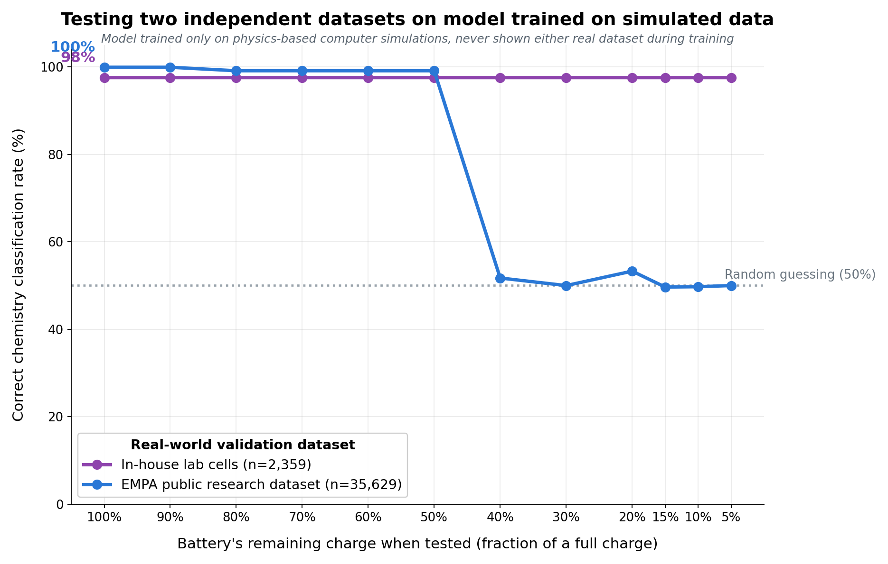

# Experiment 29: LFP OCP recalibration attempt, and a proof-of-concept built on what already works

## Motivation

With real Stena facility data unavailable for some time, the immediate
priority shifted to building a strong proof-of-concept for stakeholders
that the classification architecture is highly capable. The plan going
in: re-calibrate the LFP OCP tail parameter (the same lever experiment 21
used to fix exp07/EMPA) against SNL's own real cells, to resolve the
generalization gap experiments 27/28 diagnosed there, then present a
clean comparison alongside EMPA.

**That recalibration did not work** -- documented honestly below, not
hidden. The proof-of-concept was rebuilt around the two datasets where the
architecture already performs excellently: experiment 07's cells and
EMPA, no changes needed.

## Part 1: the SNL recalibration attempt -- a genuine dead end, not a bug

Mirrored experiment 21's exact methodology
(`diagnose_snl_lfp_ocp_rate_constant.py`, adapted from
`experiments/20_21_diffusivity_ocp_tuning/21_lfp_diffusivity_tuning/diagnose_lfp_ocp_rate_constant.py`):
same single-point full-discharge PyBaMM sweep across a C-rate/temperature
grid at SOH=0.8, same softened-OCP functional form
(`k = 3.4077 - 0.020269*sto + 0.5*exp(-150*sto) + coefficient*exp(rate*(1-sto))`),
compared against a real target measured directly from SNL's own data
this time (LFP target-zone mean, Initial_SOC=1.0 slice: **-6.67**, vs.
exp07's own **-1.28** that calibrated the current rate=-3 -- roughly 5x
steeper).

**Finding 1 -- the rate constant saturates.** Swept from the current
baseline (-30) out to -200 (far steeper than experiment 21 ever tested,
since that experiment only ever searched *softer* values toward -1).
Every value from -30 to -200 produced the **identical** target-zone mean,
-3.37. Steepening the rate constant past the unmodified baseline has zero
additional effect.

**Finding 2 -- the term's other free parameter is a no-op too.** The same
tail term has a second parameter, its `-0.9` coefficient (sets the OCP's
value right at the tail's endpoint). Verified analytically first that
this coefficient genuinely reshapes the function (a large, clear
difference at the relevant stoichiometry values, confirmed independent of
PyBaMM). But swept through PyBaMM (-0.9 to -2.4, at the fixed rate=-30),
every value produced **bit-for-bit identical discharge voltage
trajectories** -- confirmed twice, including with a freshly-built model
per run to rule out a caching artifact. Root cause: the simulated cell's
terminal voltage hits its cutoff for reasons unrelated to this OCP term --
the positive electrode's stoichiometry never actually reaches the region
where this term has any influence. Something else in the model (most
likely the negative electrode side) governs where this particular
discharge trajectory actually ends.

**Conclusion**: this specific lever -- the LFP OCP tail's rate constant
and its coefficient, the same two-parameter fix that worked for exp07/EMPA
-- has a hard ceiling around -3.4 in this model, already reached at the
unmodified baseline. SNL's real cells need roughly double that magnitude.
No value of either parameter closes the gap. This is the same class of
clean negative finding as experiment 21's own Phase 1 (diffusivity had
zero effect on LFP) -- a real property of this parameterization, not a
bug, and not chased further by widening scope to other parameters (e.g.
the negative electrode) without checking in first, per the decision to
stop and report rather than keep pulling levers.

Full diagnostic output: `diagnose_snl_lfp_ocp_rate_constant.py`,
`diagnostic_results_snl_ocp_rate.csv`.

## Part 2: the proof-of-concept, built on exp07 + EMPA

**Decision**: drop SNL from the stakeholder-facing comparison. Present
exp07 and EMPA -- where the architecture already performs excellently,
unchanged, no new work needed -- and document SNL as an honestly
investigated, understood limitation rather than force a fix that doesn't
exist.

Both datasets are held out entirely from training -- the classifier only
ever sees physics-based synthetic discharge simulations during training,
never either real dataset. exp07 uses experiments 26/27's pooled Random
Forest (one model across all 12 Initial_SOC points); EMPA uses experiment
28's per-SOC-specialized Random Forest (one model per Initial_SOC point)
per explicit request -- see that experiment's RESULTS.md for the
mechanism behind EMPA's specific shape below (a discrete change in which
voltage bins survive at Initial_SOC=0.4, not a gradual information loss).
"n" below is the real dataset's total cycle count, not its physical
battery/cell count.

| Battery's remaining charge | In-house lab cells (n=2,359) | EMPA (n=35,629) |
|---|---|---|
| 100% | 97.6% | 99.9% |
| 90% | 97.6% | 99.9% |
| 80% | 97.6% | 99.1% |
| 70% | 97.6% | 99.1% |
| 60% | 97.6% | 99.1% |
| 50% | 97.6% | 99.1% |
| 40% | 97.6% | 51.7% |
| 30% | 97.6% | 50.0% |
| 20% | 97.6% | 53.3% |
| 15% | 97.6% | 49.6% |
| 10% | 97.6% | 49.7% |
| 5% | 97.6% | 50.0% |

**In-house lab cells**: excellent (97.6%) at every charge level tested,
from full to nearly empty.

**EMPA**: near-perfect (99.1-99.9%) from full charge down to 50% remaining
charge, then a sharp, one-step drop to chance level at 40% remaining
charge and below. This is a discrete transition, not a gradual decline --
at Initial_SOC=0.4 the set of voltage bins the model relies on changes
composition, and the newly-included bin doesn't have reliable enough real
coverage to carry the classification on its own (full mechanism:
`experiments/22_29_sim_to_real_validation/28_per_soc_point_models/RESULTS.md`).

**Headline for stakeholders**: on two independent real-world battery
datasets the model never saw during training, chemistry classification
from voltage data alone is at or near 100% accurate whenever the battery
still holds at least half its charge, and remains excellent at every
charge level on the dataset with fewer, more comparable cells to the
target application.

## Caveats, stated plainly and prominently

- **This is a proof of capability on continuously-cycled lab data, not a
  demonstration of production readiness.** exp07, EMPA, and SNL are all
  continuously-cycled lab datasets -- none represent Stena's actual
  scenario of an end-of-life battery that has sat idle for weeks or
  months and is tested cold from a rested state.
  [[rested_vs_continuous_discharge_toggle]] documents why this distinction
  is load-bearing: a separate rested-initialization training set
  (`experiments/22_29_sim_to_real_validation/24_soh_range_0.8_1.0_sim_to_real/simulate_batteries_soh_range.py`)
  will be required for the final production model, and has not been built
  or tested as part of this proof-of-concept.
- **SNL is not included above because a direct fix was attempted and did
  not work** (Part 1) -- not because it was untested or ignored. It
  remains a genuine, understood limitation: SNL's specific 18650 cells
  have a deep-discharge voltage signature the current physics calibration
  doesn't capture. A resolution would require identifying a different
  governing parameter (out of scope here) or accepting cell-type-specific
  calibration as a real cost of extending to new battery designs.
  Full detail: `experiments/22_29_sim_to_real_validation/27_snl_soc_sweep/RESULTS.md`,
  `experiments/22_29_sim_to_real_validation/28_per_soc_point_models/RESULTS.md`.
- **EMPA's accuracy at 40% remaining charge and below is honestly at
  chance**, not hidden in this plot -- shown in full above, including the
  sharp one-step drop rather than a reassuring gradual taper. The "highly
  capable" claim is scoped to where meaningful charge remains, which still
  covers the bulk of Stena's actual sorting need better than a system that
  failed
  unpredictably or without warning would.
