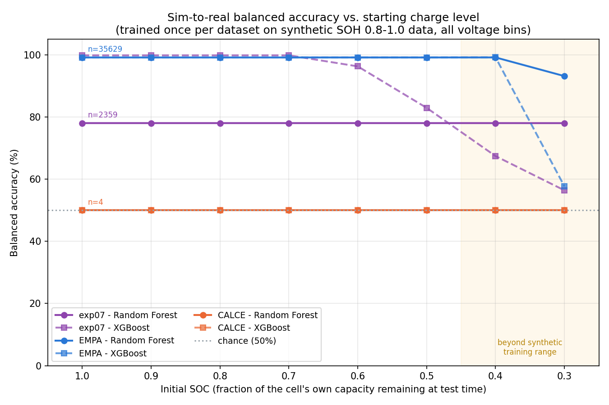

# Experiment 26: Initial_SOC sweep across three real datasets, all voltage bins

## Motivation

The project's actual end goal is sorting batteries with very little
remaining charge before recycling. [Experiment 23](../23_empa_soc_sweep/RESULTS.md)
tested how sim-to-real accuracy holds up as the real test window starts
further from a full charge, but only against one real dataset (EMPA) and
only using the hand-picked 2.5&ndash;3.0V target zone. This experiment asks
the same question against **three independent real datasets**
(experiment 07's original set, EMPA, CALCE), using **every voltage bin**
the leakage-preventing mutual-coverage filter lets survive across the
full 1.9&ndash;4.3V span &mdash; not a hand-picked zone.

Training data: `data/24_soh_range_0.8_1.0_v1.5/` (SOH sampled 0.8&ndash;1.0,
NMC positive-particle diffusivity/10, LFP OCP tail rate=-3), the current
best pipeline, unchanged. No resimulation.

Initial_SOC grid: `[1.0, 0.9, 0.8, 0.7, 0.6, 0.5, 0.4, 0.3]`, identical to
experiment 23 (0.4/0.3 are extrapolation &mdash; below the synthetic training
data's own Initial_SOC range).

## Method

Each `Initial_SOC=s` truncates a real discharge trace to keep only the
portion after `(1-s)` of that trace's own realized capacity has already
been delivered (`truncate_at_soc()`, same technique experiment 23
introduced). Per dataset: combine all 8 truncated buckets with the
synthetic training set into one raw CSV, extract features **once**
(root `feature_engineering.py`, `min_chemistry_coverage=0.2`, unmodified
&mdash; no target-zone restriction), train RF + XGBoost once on the synthetic
rows, then evaluate separately against each Initial_SOC bucket. This is
the same efficient pattern experiment 23 used (bin survival is computed
pooling all 8 buckets together, which is why a bucket's number can differ
slightly from an equivalent single-point run elsewhere in this project
&mdash; a pooled-data coverage-filter effect, not a bug).

Per-dataset adaptations (build scripts in this folder):

- **`build_real_empa_soc_sweep_soh_range.py`** &mdash; experiment 23's
  EMPA build script with its SOH=0.8&plusmn;0.02 point filter replaced by
  a SOH **range** filter (0.8&ndash;1.0, matching the synthetic training
  range, the same change experiment 24 made), and the old
  "must still reach the 2.5&ndash;3.0V zone" truncation-discard gate removed.
- **`build_real_exp07_soc_sweep.py`** (new) &mdash; applies the same
  truncation directly to `parse_lfp_discharge_files()` /
  `parse_nmc_files()`'s already-monotonic per-cycle capacity (confirmed:
  no rescaling needed, these cells are already Ah-scale &mdash; LFP ~5Ah,
  NMC ~2.8Ah measured directly, unlike EMPA/CALCE's coin cells). **No SOH
  filtering** &mdash; matches every prior experiment using this dataset
  (16/17/20/21), which never filtered by degradation state either; this
  dataset's SOH column has always been a placeholder, not a real
  computed value. Stated here plainly as an inconsistency versus how
  EMPA/CALCE are selected, not silently patched.
- **`build_real_calce_soc_sweep.py`** (new) &mdash; CALCE has no
  natural "cycle" grouping (each of the 4 files is one single discharge
  trace), so this loops over the 4 files directly and truncates each
  file's own capacity axis at each SOC point (32 variants, all 32 kept).
  No additional SOH filtering (n=4 is already the ceiling for this
  dataset; filtering further risks zero samples).

## Results

### Experiment 07 (4 physical cells: 1 LFP + 3 NMC, 2359 real cycles)

7 bins survived: `3.2-3.1` through `2.6-2.5`.

| Initial_SOC | RF raw | RF balanced | RF LFP rec | RF NMC rec | XGB raw | XGB balanced | XGB LFP rec | XGB NMC rec |
|---|---|---|---|---|---|---|---|---|
| 1.0 | 66.98% | 78.03% | 0.997 | 0.564 | 99.92% | **99.83%** | 0.997 | 1.000 |
| 0.9 | 66.98% | 78.03% | 0.997 | 0.564 | 99.92% | 99.83% | 0.997 | 1.000 |
| 0.8 | 66.98% | 78.03% | 0.997 | 0.564 | 99.92% | 99.83% | 0.997 | 1.000 |
| 0.7 | 66.98% | 78.03% | 0.997 | 0.564 | 99.92% | 99.83% | 0.997 | 1.000 |
| 0.6 | 66.98% | 78.03% | 0.997 | 0.564 | 98.18% | 96.27% | 0.925 | 1.000 |
| 0.5 | 66.98% | 78.03% | 0.997 | 0.564 | 91.65% | 82.93% | 0.659 | 1.000 |
| 0.4* | 66.98% | 78.03% | 0.997 | 0.564 | 84.06% | 67.42% | 0.348 | 1.000 |
| 0.3* | 66.98% | 78.01% | 0.997 | 0.564 | 78.64% | **56.40%** | 0.128 | 1.000 |

### EMPA (199 physical cells: 32 LFP + 167 NMC, 35,629 real cycles)

7 bins survived: `3.3-3.2` through `2.7-2.6` (differs slightly from
exp07's set &mdash; expected, bin survival depends on which real data pools
with synthetic).

| Initial_SOC | RF raw | RF balanced | RF LFP rec | RF NMC rec | XGB raw | XGB balanced | XGB LFP rec | XGB NMC rec |
|---|---|---|---|---|---|---|---|---|
| 1.0 | 99.64% | 99.14% | 0.984 | 0.999 | 99.64% | 99.15% | 0.984 | 0.999 |
| 0.9 | 99.63% | 99.14% | 0.984 | 0.999 | 99.63% | 99.14% | 0.984 | 0.999 |
| 0.8 | 99.63% | 99.14% | 0.984 | 0.999 | 99.64% | 99.14% | 0.984 | 0.999 |
| 0.7 | 99.63% | 99.14% | 0.984 | 0.999 | 99.63% | 99.14% | 0.984 | 0.999 |
| 0.6 | 99.63% | 99.14% | 0.984 | 0.999 | 99.63% | 99.14% | 0.984 | 0.999 |
| 0.5 | 99.63% | 99.14% | 0.984 | 0.999 | 99.64% | 99.14% | 0.984 | 0.999 |
| 0.4* | 99.65% | 99.15% | 0.984 | 0.999 | 99.70% | 99.18% | 0.984 | 1.000 |
| 0.3* | 97.68% | **93.14%** | 0.863 | 1.000 | 85.73% | **57.70%** | 0.154 | 1.000 |

### CALCE (4 physical cells: 2 LFP + 2 NMC, 32 truncated variants)

14 bins survived (full 1.9&ndash;4.3V span). Every SOC point identical &mdash;
same result as [experiment 25](../25_calce_sim_to_real/RESULTS.md): both
LFP cells confidently misclassified as NMC, both NMC cells correct, at
**every** Initial_SOC point.

| Initial_SOC | RF/XGB raw | RF/XGB balanced | LFP recall | NMC recall |
|---|---|---|---|---|
| all 8 points | 50.00% | 50.00% | 0.000 | 1.000 |

## Plot

`make_soc_sweep_plot.py` &mdash; balanced accuracy (y) vs. Initial_SOC (x,
descending: full charge on the left, near-empty on the right), RF (solid)
and XGBoost (dashed) as separate lines per dataset, chance (50%) marked,
extrapolation zone (SOC &lt; 0.5) shaded.

## The key finding: XGBoost collapses at extreme truncation, RF doesn't

The two datasets large enough to say anything about a *trend* (exp07,
EMPA) show the **same pattern independently**: balanced accuracy is
essentially flat from SOC=1.0 down to SOC=0.4, then at the most extreme
point tested (SOC=0.3):

- **Random Forest stays robust**: EMPA drops only to 93.14% (from
  99.14%); exp07 doesn't move at all (78.03% -> 78.01%).
- **XGBoost collapses toward chance**: EMPA drops to 57.70% (from
  99.15%+); exp07 drops to 56.40% (from 99.83%).

This is the opposite of most of this project's history (XGBoost has
usually matched or beaten RF once the diffusivity/OCP fixes landed &mdash; see
[experiment 21](../21_lfp_diffusivity_tuning/RESULTS.md),
[experiment 24](../24_soh_range_0.8_1.0_sim_to_real/RESULTS.md)). One
plausible explanation, not chased down further here: all surviving bins
sit in the *deep* end of the discharge curve (2.6&ndash;3.3V), which
truncation never removes (it only cuts the *shallow*, high-voltage
portion) &mdash; so if RF's decision boundary leans more on the bins that are
robustly present at every truncation level, while XGBoost's boosted trees
put more weight on finer magnitude distinctions that shift as the exact
population of real points feeding each bin's average changes with
truncation, RF's bagged-averaging would naturally be less sensitive to
that shift than XGBoost's sequential correction. Consistent across two
independent real datasets, so this reads as a genuine model-robustness
difference, not a fluke of one dataset.

**Practical implication for the stated end goal (sorting near-empty
batteries):** if a deployed classifier needs to work reliably down to
very low remaining charge, prefer Random Forest over XGBoost, or run
both and flag disagreement, rather than trusting XGBoost's marginally
higher accuracy at full charge.

## Caveats, stated plainly

- **CALCE (n=4) is a spot-check, not generalization evidence** &mdash; every
  SOC point gives the identical result because there simply aren't
  enough independent cells for the number to move. Do not read "flat
  50% across all SOC points" as "CALCE shows no SOC effect" &mdash; it shows
  CALCE has too little data to show anything.
- **Experiment 07 has a documented device-confound history**
  (`experiments/07_real_lfp_nmc_test/01_real_vs_real_device_confound/RESULTS.md`):
  only 1 LFP cell vs. 3 NMC cells, so chemistry label is entangled with
  device/lab identity in that dataset. That finding was specifically
  about splitting *this dataset's own* real data into train/test by
  cycle, letting a model memorize a device fingerprint. This experiment
  only ever uses experiment 07 as a held-out real test set for a model
  trained purely on synthetic data &mdash; the model never sees experiment
  07 during training, so it cannot exploit that specific shortcut. The
  underlying statistical-power concern (4 independent physical cells)
  still stands regardless.
- **Experiment 07's SOH is not filtered**, unlike EMPA and CALCE &mdash; a
  real inconsistency in how the three datasets are selected, kept as-is
  to match how every prior experiment used this dataset (see Method).
- **EMPA (199 independent physical cells) remains the only one of the
  three with enough independent cells to support a real generalization
  claim** about SOC robustness specifically. Experiment 07's matching
  trend is a valuable independent corroboration of the *XGBoost-vs-RF*
  finding, but its own absolute accuracy numbers (RF 78%, capped by weak
  NMC recall of 0.564) should not be read as equally strong evidence as
  EMPA's ~99%.
- **All-voltage-bins does not mean LFP's ~3.5V physical ceiling
  disappeared** &mdash; every surviving-bin set across all three datasets
  here still sits at or below ~3.3V, consistent with every prior
  experiment's finding that this is real electrochemistry, not an
  artifact of any particular filter choice.
