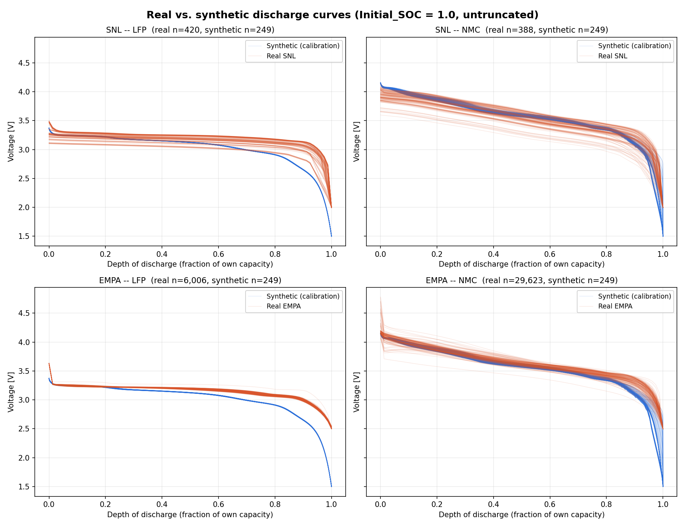
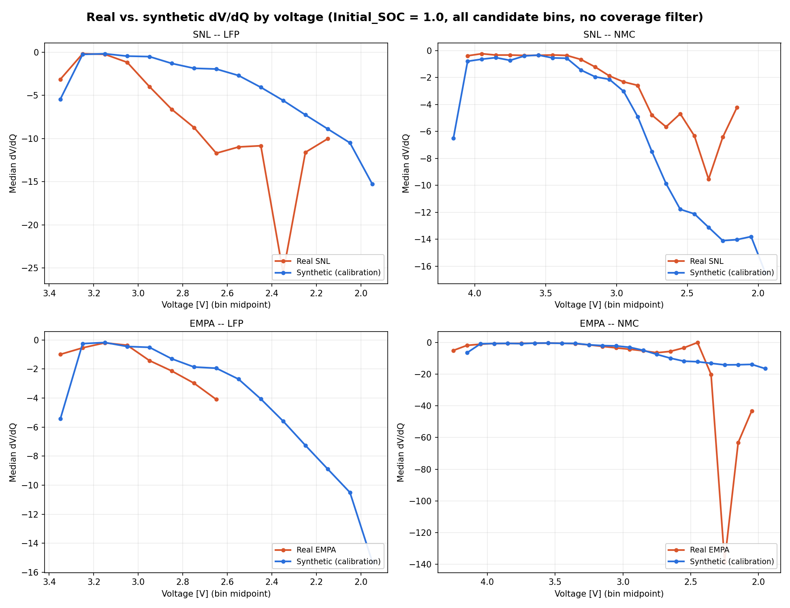

# Experiment 31: seeing the calibration mismatch, not just the numbers

## What this is

A purely visual/diagnostic experiment -- no new data, no resimulation, no
new findings beyond what experiments 27-29 already established
numerically. Plots real SNL and EMPA discharge curves directly against
the synthetic calibration data (the same continuous-discharge-truncated
baseline used throughout experiments 26-29), so the mismatch already
described in tables and per-bin medians can actually be seen.

Data: `Initial_SOC == 1.0` (untruncated) slices of the already-built
`26_soh_range_continuous_discharge_truncated_v1` (synthetic),
`26_real_empa_soc_sweep_soh_range` (real EMPA), and `27_real_snl_soc_sweep`
(real SNL) CSVs. Real traces subsampled to 150 per panel for readability
(EMPA alone has tens of thousands at this SOC point); synthetic shown in
full (249 per chemistry).

## Figure 1: voltage vs. depth of discharge

Each curve's capacity normalized to its own fraction of total delivered
capacity, so differently-sized cells (SNL ~1-3Ah, EMPA coin cells
rescaled to 2Ah, synthetic 1.2/2.0/3.5Ah) overlay on a comparable axis.

- **SNL LFP**: real cells (orange) sit clearly *above* synthetic (blue)
  for most of the discharge and taper off far more gradually, plateauing
  around 2.5-3.0V near full depth rather than continuing down to
  synthetic's 1.5V cutoff. Real LFP's actual "knee" is compressed into a
  much narrower depth-of-discharge window near its own end -- exactly the
  shape difference the dV/dQ numbers in experiment 29 were describing.
- **SNL NMC**: real and synthetic track closely for most of the curve,
  diverging mainly near the very end.
- **EMPA (both chemistries)**: real and synthetic track closely across
  almost the entire curve -- visually consistent with EMPA's strong
  classification performance throughout this project.
- **An artifact these plots surfaced, investigated and fixed**: an
  earlier version of these plots showed a handful of real traces (mostly
  SNL) with a brief, physically impossible rise to ~2.0V right at the
  start of discharge, and a corresponding spurious *positive* dV/dQ
  spike in Figure 2. Root-caused to a parsing bug in
  `build_real_snl_soc_sweep.py`: SNL's test equipment occasionally logs
  the single leftover sample from the END of a cycle's discharge under
  the NEXT cycle's index (at the discharge -> charge -> discharge
  boundary). That stray point sits at the low cutoff voltage with
  capacity reset to 0, and got prepended ahead of the real discharge's
  actual start, which `resample_on_capacity()` then smoothed into a
  ~2-hour "rising voltage" segment. Confirmed via raw-file inspection
  (isolated to the 35C/0.5-2C LFP cells) and via retraining a classifier
  on data with vs. without the affected cycles -- the bug did not
  meaningfully change reported sim-to-real accuracy either way (the
  40 affected cycles were already classified correctly ~95% of the
  time), so it doesn't explain SNL's generalization gap, but it was a
  genuine data-quality issue worth fixing regardless. Fixed in
  `discharge_segments()` by splitting on the large time gap the
  leftover sample creates and keeping only the cycle's real, contiguous
  discharge; data rebuilt and the plots above regenerated with the fix
  applied (full detail: `experiments/22_29_sim_to_real_validation/27_snl_soc_sweep/build_real_snl_soc_sweep.py`).

## Figure 2: dV/dQ vs. voltage (the feature space the classifier uses)

Median dV/dQ per 0.1V bin, computed via the same
`feature_engineering.create_features_by_voltage_bins()` every experiment
in this project uses, but with `min_chemistry_coverage=0.0` (showing the
full candidate range, not just bins that would survive the
leakage-prevention filter used for actual training).

- **SNL LFP**: real and synthetic track closely down to ~2.6V, then real
  becomes visibly *steeper* (more negative) than synthetic through the
  2.6-2.2V range -- the exact mismatch experiment 29 measured numerically
  (real ~-10 to -11 vs. synthetic ~-2 to -4 in this region).
- **SNL NMC**: real and synthetic track closely down to ~3.0V, then real
  becomes visibly *noisier and shallower* than synthetic's smooth,
  steepening decline -- the mirror image of the LFP case, and the
  mechanism behind why real SNL LFP ends up looking more "NMC-shaped" to
  the classifier than real SNL NMC does.
- **EMPA (both chemistries)**: real and synthetic track each other closely
  across the entire well-covered range -- a visual match consistent with
  EMPA's strong classification performance.
- **Wild swings at the deepest bins in some panels** (e.g. SNL LFP
  dipping to -24 then back to -10, EMPA NMC diving past -120) are
  sparse-coverage artifacts -- a median of only a handful of real points
  that deep, not a meaningful signal. Visually dramatic, statistically
  fragile; not evidence of anything beyond what's already documented
  about thin coverage at extreme depths of discharge.

## Takeaway

These plots don't establish anything new -- they make experiments 27-29's
numerical findings visible. The calibration that works well for EMPA
visibly *does* track EMPA's real curves closely in both voltage and
dV/dQ space; the same calibration visibly does *not* track SNL's real LFP
curve the same way, in exactly the deep-discharge region already
identified as the source of SNL's classification failure.
