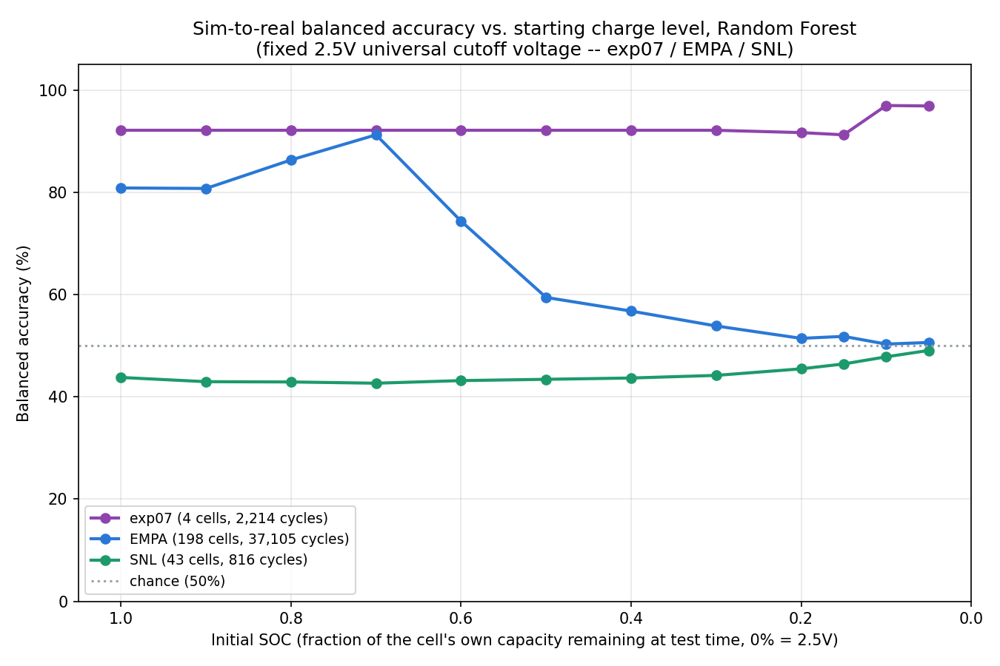

# Experiment 32: a fixed, universal voltage cutoff defines "0% SOC"

## Motivation

Every prior SOC-sweep experiment in this project (23/26/27/28/29) defined
"0% SOC" self-referentially: whatever voltage a given real cycle (or
synthetic full discharge) happened to stop at was that cycle's own 0%,
and Initial_SOC was a fraction of that cycle's own realized capacity.
That means exp07, EMPA, CALCE, and SNL were each being compared on their
own private definition of "empty" -- not necessarily the same physical
voltage.

This experiment redefines "0% SOC" project-wide as **one fixed, absolute
voltage**: wherever EMPA's own real test equipment stops. The same
voltage is then applied to exp07 and SNL's real data too, *and* to the
synthetic PyBaMM training data's own discharge termination -- so training
and every real test set agree on the same physical "empty," rather than
each dataset (synthetic included) defining it independently.

## Picking the cutoff voltage

Measured directly from each real dataset's own per-cycle minimum voltage
(Initial_SOC=1.0, untruncated full discharges):

| Dataset | Chemistry | Median per-cycle min voltage |
|---|---|---|
| EMPA | LFP | 2.4998 V |
| EMPA | NMC | 2.4999 V |
| exp07 | LFP | 2.496 V |
| exp07 | NMC | 2.4999 V |
| SNL | LFP/NMC | ~2.0 V (natively discharges well past 2.5V) |

exp07 and EMPA's real cells -- independently, with no coordination --
already stop almost exactly at the same voltage. That's strong evidence
this is a real, shared lab-equipment safety cutoff, not a coincidence of
one dataset. **CUTOFF_VOLTAGE = 2.5V** is used throughout this
experiment (a clean round number sitting inside all four measured
medians above).

SNL's cells are rated lower and natively continue down to ~2.0V. Per
explicit confirmation before building this experiment, SNL is trimmed to
2.5V too, even though this discards its deepest ~0.5V of real data --
including the specific region experiments 27/29 identified as carrying
SNL's most LFP-diagnostic (and most sim-mismatched) signal. This is a
deliberate tradeoff: project-wide comparability against one fixed
physical voltage, at the cost of SNL's deepest region.

## Method

New shared function `trim_to_cutoff_voltage()`
(experiments/22_29_sim_to_real_validation/26_soc_sweep_three_datasets/soc_truncation.py,
purely additive -- `truncate_at_soc()` itself is untouched and every
earlier experiment that calls it is unaffected): given a full discharge
trace, interpolates the exact (time, voltage, capacity) where voltage
first crosses down through a given cutoff voltage, and returns the trace
trimmed to end there. Feeding that trimmed trace into the existing
`truncate_at_soc()` makes "0% SOC" mean that cutoff voltage, instead of
the trace's own raw final point.

- **Synthetic** (`simulate_batteries_fixed_voltage_cutoff.py`): identical
  to experiment 26's continuous-discharge-truncated generator (same SOH
  range, C-rate range, NMC diffusivity/10 fix, LFP OCP rate=-3 fix) except
  the PyBaMM discharge experiment itself now terminates at 2.5V for BOTH
  chemistries (`"Discharge at X A until 2.5 V"`), replacing the previous
  chemistry-shared-but-arbitrary 1.5V. 0/498 solve attempts failed.
- **exp07, EMPA, SNL** (`build_real_*_fixed_cutoff.py`): each cycle's raw
  trace is trimmed via `trim_to_cutoff_voltage()` *before* BOL-capacity
  establishment and before `truncate_at_soc()` -- so both "capacity" and
  "SOH" are now computed relative to the 2.5V crossing, not each cycle's
  raw stopping point. SNL's build also keeps the lead-in-artifact fix
  from experiment 27/31 unchanged. A side effect for EMPA: trimming
  exactly at the voltage crossing also clips off any trailing rest-phase
  samples past the real cutoff (the artifact noted in experiment 22's
  RESULTS.md), for free.
- **CALCE dropped** -- not requested for this experiment.
- **Evaluation** (`evaluate_soc_sweep_fixed_cutoff.py`): same methodology
  as experiment 27 (`evaluate_soc_sweep_four_datasets.py`) -- one Random
  Forest per dataset, trained ONLY on the (new, 2.5V-cutoff) synthetic
  data, evaluated separately at each of the 12 Initial_SOC buckets on
  that dataset's real data. Balanced accuracy reported throughout
  (experiment 20 Part B's mandatory lesson). Also records each dataset's
  total unique physical cells and total discharge cycles (pooled across
  all 12 Initial_SOC points), for the plot's legend.

## Results

| Initial_SOC | exp07 | EMPA | SNL |
|---|---|---|---|
| 1.0 | 92.14% | 80.85% | 43.79% |
| 0.9 | 92.14% | 80.76% | 42.96% |
| 0.8 | 92.14% | 86.34% | 42.91% |
| 0.7 | 92.14% | 91.25% | 42.66% |
| 0.6 | 92.14% | 74.36% | 43.17% |
| 0.5 | 92.14% | 59.44% | 43.43% |
| 0.4 | 92.14% | 56.77% | 43.68% |
| 0.3 | 92.14% | 53.86% | 44.19% |
| 0.2 | 91.68% | 51.44% | 45.48% |
| 0.15 | 91.25% | 51.82% | 46.43% |
| 0.1 | 96.98% | 50.32% | 47.83% |
| 0.05 | 96.90% | 50.63% | 49.07% |

Legend cell/cycle counts: exp07 (4 cells, 2,214 cycles), EMPA (198
cells, 37,105 cycles), SNL (43 cells, 816 cycles).

## Why this looks different from experiment 27's plot

Trimming every dataset -- synthetic included -- to end at 2.5V instead of
each one's own deeper native/solver cutoff (previously 1.5V synthetic,
~1.5-2.0V real) shrinks the usable voltage-bin feature space itself:
the mutual-coverage filter now keeps only **7-8 bins, all between 3.3V
and 2.5V**, versus 14-24 bins reaching down to 2.0-1.9V in experiments
26-29. This is a direct, intended consequence of the fixed cutoff, not a
bug -- but it changes what the classifier can learn, for every dataset,
not only SNL:

- **exp07** stays strong throughout (92-97%), even improving slightly at
  the lowest SOC points (96-97% at 0.1/0.05) -- its chemistry separation
  evidently doesn't depend on the deep-discharge region that was cut off.
- **EMPA** now shows an early, sharp decline -- dropping from 91.25% at
  Initial_SOC=0.7 to 59.44% by 0.5 and settling near chance by 0.2 --
  instead of the gradual decline experiment 27 found (reaching chance
  only around Initial_SOC=0.4). EMPA's own full-discharge accuracy
  (Initial_SOC=1.0) also dropped, from 89.23% (experiment 27, trained on
  the old deeper-cutoff synthetic) to 80.85% here: the training feature
  space itself is narrower now, a real cost of this redefinition, not an
  artifact of EMPA's own real data changing (it barely did -- EMPA's
  native cutoff was already ~2.5V).
- **SNL** stays at or below chance throughout, as in every prior
  experiment -- unsurprising, and now additionally constrained since its
  most LFP-diagnostic deep region was deliberately excluded by design
  (see above).

**Interpretation**: once "0% SOC" is pinned to a shallow, lab-equipment
-level cutoff (2.5V) rather than each dataset's own deeper stopping
point, "the last 5-20% of charge" becomes a narrow voltage band close to
that cutoff for every dataset -- there's much less physical depth left
to carry a distinguishing signal. exp07's chemistries apparently still
separate cleanly in that shallow band; EMPA's and SNL's do not, at least
not with this synthetic calibration.

## Caveats

- This is a different *definition* of Initial_SOC/0%-SOC from
  experiments 26-29, not a replacement for them -- neither is "more
  correct" in the abstract; which one matches a target real-world
  scenario depends on what voltage that equipment actually stops at.
- Like every other sim-to-real experiment in this project, this is a
  proof of capability on continuously-cycled lab data, not the Stena
  Recycling production scenario (rested, idle-then-tested cells) -- see
  [[rested_vs_continuous_discharge_toggle]].
- CALCE was not rebuilt/evaluated here (not requested); re-adding it
  would follow the same `build_real_calce_soc_sweep.py` ->
  `trim_to_cutoff_voltage()` pattern used for the other three.
