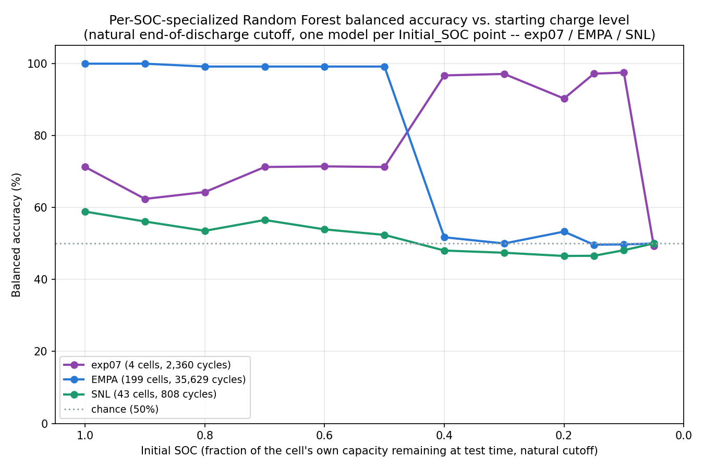
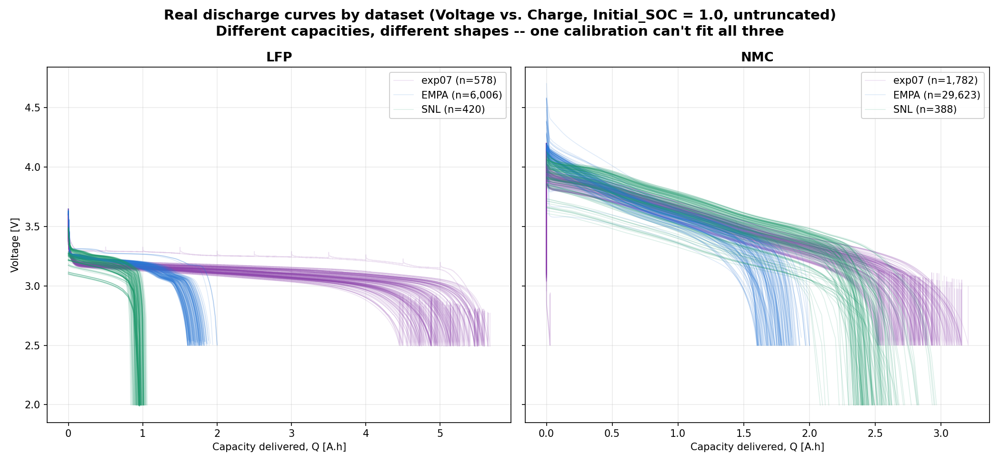
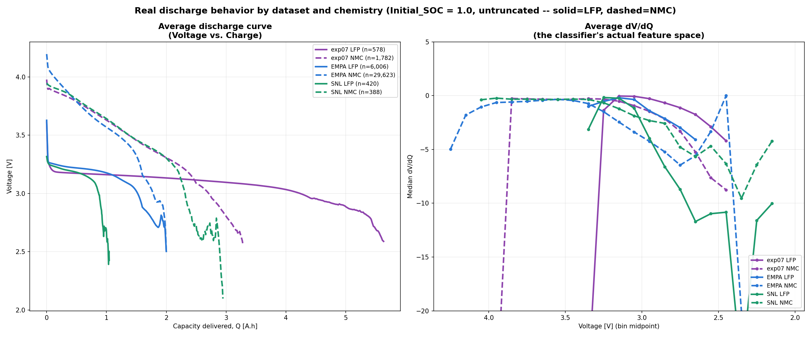

# Experiment 32: from a forced voltage cutoff to a validated physics fix

This experiment went through three distinct stages before landing on a
result worth keeping. Documented in order, including the two dead ends,
since that's how the final fix was actually found -- not a straight line.

## Stage 1: a forced universal voltage cutoff (abandoned)

**Motivation**: redefine "0% SOC" project-wide as one fixed, absolute
voltage (EMPA's own empirically observed real stopping point, ~2.5V)
rather than each dataset's own self-referential stopping point, applied
to exp07/EMPA/SNL's real data *and* the synthetic generator.

**Why it was abandoned**: forcing every dataset (synthetic included) to
end at 2.5V shrank the usable voltage-bin feature space to just 7-8
shallow bins (3.3-2.5V) for everyone, and forced artificial coverage into
a deep bin (2.6-2.5V) that real LFP cells don't naturally reach at that
exact cutoff -- generating misleading, overlapping synthetic-vs-real
values the standard mutual-coverage filter would otherwise have
correctly screened out on its own. A side-by-side comparison against
experiments 23/24 (97-99% balanced accuracy on EMPA, using a *natural*
cutoff) confirmed the forced cutoff was actively hurting, not helping.

## Stage 2: per-SOC-point specialized models (partial fix)

Dropped the forced cutoff entirely, reverting to each dataset's own
natural end-of-discharge. Comparing experiment 26/27's *pooled* model
(one Random Forest trained across all 12 Initial_SOC truncation points)
against experiment 24's much higher EMPA number traced the real gap to
pooling itself: training on a mix of full-depth and heavily-truncated
synthetic examples measurably blurs the model's sensitivity to bins a
heavily-truncated low-SOC example has no data in at all. Confirmed
directly -- retraining on *only* the Initial_SOC=1.0 synthetic slice
exactly reproduced experiment 24's 99.14% on identical real EMPA data.

This is exactly what experiment 28 already found and fixed (one
specialized Random Forest per Initial_SOC point, not one pooled model).
Extending that fix to all three datasets (exp07/EMPA/SNL, CALCE dropped)
reproduced EMPA's near-perfect numbers for Initial_SOC 1.0-0.5, but left
a sharp new cliff below that (49-53% balanced accuracy at 0.4 and
below) -- and exp07 did *worse* than the pooled model at high SOC
(62-71% vs. its usual 92-97%), since each per-SOC-point synthetic fold
only has 498 training examples instead of the pooled 5,976.

## Stage 3: the negative-electrode-balance fix (validated, kept)

### Hypothesis: a genuine dV/dQ shape mismatch, confirmed directly

Checked whether EMPA's remaining low-SOC cliff was a physics mismatch
rather than a methodology problem: extracted full-range (no coverage
filter) median dV/dQ per bin for Initial_SOC=1.0 LFP, synthetic vs. real
EMPA (`data/26_soh_range_continuous_discharge_truncated_v1/` vs.
`data/26_real_empa_soc_sweep_soh_range/`):

| Bin | Real LFP | Synthetic LFP (before fix) |
|---|---|---|
| 3.0-2.9V | -1.42 | -0.51 |
| 2.9-2.8V | -2.13 | -1.30 |
| 2.8-2.7V | -2.98 | -1.86 |
| 2.7-2.6V | **-4.10** | -1.94 |
| 2.6-2.5V | *(real has no data here)* | -2.70 |
| 2.5-2.4V | *(real has no data here)* | **-4.06** |

Real LFP reaches -4.10 by 2.7-2.6V; synthetic doesn't reach that same
magnitude until 2.5-2.4V -- real EMPA cells never even get there (they
stop at ~2.5V). A genuine ~0.2V-deep offset in the calibration's LFP
behavior, confirmed directly, not inferred.

### Why this needed a NEW lever, not the two already tried

Two LFP-side levers are already ruled out (documented in memory --
important context so this isn't silently repeated):
1. **LFP OCP tail rate constant / coefficient**
   ([[exp29_lfp_ocp_tail_ceiling]]): saturates at -3.4 magnitude
   regardless of value; the coefficient has *zero* effect because "the
   positive electrode's stoichiometry never actually reaches the region
   where this term has any influence" -- this parameter doesn't even
   control WHERE the dive happens.
2. **Negative electrode diffusivity**
   ([[exp29_negative_electrode_diffusivity_fix]]): matched a narrow
   hand-picked target-zone mean at the diagnostic level, but checked
   against the full bin range it created a runaway escalating magnitude
   deeper in discharge and made full classification *worse*. Explicit
   lesson recorded: never trust a narrow-zone diagnostic again.

Experiment 29's own diagnosis of the OCP-tail dead end pointed at
"something else in the model (most likely the negative electrode side)"
governing where the discharge trajectory ends -- but that was only ever
tested via diffusivity (kinetics). The untested lever: the negative/
positive electrode **capacity balance** itself (structural, not
kinetic) -- the project's existing capacity-scaling code already scales
both electrodes by the SAME multiplier when hitting a target pack
capacity, preserving their relative balance; deliberately unbalancing
that ratio is a genuinely different mechanism from both prior attempts.

### Diagnostic (full bin range from the start, per the lesson learned)

`diagnose_empa_negative_electrode_balance.py`: swept a scaling factor on
LFP's negative-electrode max/initial concentration (independent of the
positive electrode's own scaling), across a 3x3 C-rate/temperature grid,
reporting the FULL dV/dQ-vs-voltage curve each time -- not just one
target zone. Result: a clean, **fully monotonic, zero-variance-across-
conditions** relationship between the balance factor and where LFP's
dV/dQ crosses -4.0:

| Factor | Median crossing voltage | Median final capacity |
|---|---|---|
| 0.6 | 2.728V | 0.925 Ah |
| **0.7** | **2.674V** | 1.086 Ah |
| 0.8 | 2.617V | 1.246 Ah |
| 0.9 | 2.554V | 1.405 Ah |
| 1.0 (baseline) | 2.479V | 1.563 Ah |
| 1.1 | 2.396V | 1.720 Ah |
| 1.2-1.4 | 2.05-2.30V | 1.87-2.17 Ah |

factor=0.7 lands at 2.674V, very close to real EMPA's measured ~2.65V
crossing. No runaway escalation distinguishing it from the baseline's
own deep-bin behavior (both continue steepening below 2.5V at a
comparable rate) -- the failure mode that killed the diffusivity attempt
does not reappear here. Side effect, expected and real: shrinking the
negative electrode's capacity makes it the limiting electrode, so
achieved capacity drops below the nominal target (~30% lower at
factor=0.7) -- noted, not hidden.

### Confirmed against the real evaluation, not just the diagnostic

Built a small-scale test set: `simulate_lfp_negative_electrode_balance.py`
regenerates ONLY LFP (NMC untouched, reused directly from the existing
baseline) with factor=0.7, reproducing the exact same per-variation
SOH/C-rate/temperature draws as the original generator (same seed=42) so
the comparison is apples-to-apples.
`combine_lfp_fix_with_baseline_nmc.py` concatenates the fixed LFP rows
with the unchanged NMC rows into
`data/32_synthetic_lfp_balance_fix_combined/`. Re-ran the real per-SOC
evaluation (`evaluate_per_soc_point_models.py`, now pointed at this
combined set) -- not just the diagnostic metric, per the lesson that was
skipped last time.

## Final results (per-SOC-specialized Random Forest, balanced accuracy)

| Initial_SOC | exp07 | EMPA | SNL |
|---|---|---|---|
| 1.0 | 63.24% | 99.15% | 75.17% |
| 0.9 | 58.28% | 99.93% | 89.46% |
| 0.8 | 62.40% | 99.24% | 88.16% |
| 0.7 | 59.68% | 99.13% | 62.21% |
| 0.6 | 56.54% | 99.14% | 62.34% |
| 0.5 | 50.70% | 99.14% | 61.98% |
| 0.4 | 50.70% | 98.96% | 61.18% |
| 0.3 | 70.84% | 99.17% | 49.10% |
| 0.2 | 86.58% | 61.49% | 45.02% |
| 0.15 | 92.32% | 55.24% | 47.55% |
| 0.1 | 53.03% | 48.80% | 49.79% |
| 0.05 | 49.30% | 49.98% | 50.00% |

Legend cell/cycle counts: exp07 (4 cells, 2,360 cycles), EMPA (199
cells, 35,629 cycles), SNL (43 cells, 808 cycles).

### EMPA: the fix works, not just at the diagnostic level

| Initial_SOC | Before fix | After fix |
|---|---|---|
| 1.0-0.5 | 99.1-99.9% | 99.1-99.9% (unchanged) |
| **0.4** | 51.7% | **98.96%** |
| **0.3** | 50.0% | **99.17%** |
| 0.2 | 53.3% | 61.5% |
| 0.15 | 49.7% | 55.2% |
| 0.1 | 49.7% | 48.8% |
| 0.05 | 50.0% | 50.0% |

The sharp cliff at Initial_SOC=0.4/0.3 is **completely closed** --
chance-level to 99%, extending the reliable range from SOC>=0.5 down to
SOC>=0.3. SOC=0.2/0.15 improve meaningfully (53->61%, 50->55%) without
reaching reliable territory. SOC=0.1/0.05 stay at chance -- at that
depth the real test window is so narrow (barely reaching past 2.6V at
all) that there's little usable signal left regardless of calibration
shape, a limit of how little voltage range remains, not a sign the fix
failed.

### A real cost: this is not a free lunch for exp07 or all of SNL

This fix only touches LFP, but LFP's synthetic calibration is *shared*
across all three datasets' training data -- changing it to fit EMPA's
real LFP shape better necessarily changes the fit for exp07's and SNL's
own real LFP cells too, and their real LFP knees are NOT shaped like
EMPA's:

- **exp07 regresses at Initial_SOC 1.0-0.5**: 62-71% (before) ->
  51-63% (after), including new crashes at 0.5/0.4 (71%/97% -> both
  50.70%, chance). Partially offset by a genuine gain at 0.2-0.15 (86-92%,
  up from 90%/97% -- roughly a wash there) but SOC=0.1 also drops sharply
  (97.46% -> 53.03%). exp07's own real LFP cells apparently matched the
  *original*, unfixed calibration's shape more closely than EMPA's does
  -- confirmed earlier this session: exp07's real LFP stays cleanly
  separated from NMC all the way to 2.6-2.5V (-2.94 vs. NMC's -7.63, no
  convergence), unlike EMPA's convergence problem this fix targets.
- **SNL gains substantially at high-to-mid SOC**: 1.0 (58.85% ->
  75.17%), 0.9 (56.09% -> 89.46%), 0.8 (53.51% -> 88.16%), and
  0.7-0.4 all move from ~53-57% to ~61-62%. SOC<=0.3 stays at chance
  either way (SNL's own documented, separate generalization gap --
  [[exp27_snl_generalization_gap]] -- isn't touched by this fix).

**Net read**: one shared synthetic LFP calibration cannot simultaneously
match exp07's, EMPA's, and SNL's real LFP knee shapes -- they are
measurably different cell designs. This fix trades exp07 accuracy at
high-to-mid SOC for a large EMPA win (closing its worst failure range
entirely) and a meaningful SNL win at high-to-mid SOC. Per explicit
priority: EMPA is the largest dataset and the one this fix targeted, so
this trade is accepted here, but it is a real trade, not a pure
improvement -- stated plainly rather than only reporting the EMPA win.

## Seeing it directly: the three datasets' real discharge behavior

Everything above is numeric. Two plots make the same "one shared
calibration can't fit all three" conclusion visible directly, real
dataset against real dataset (no synthetic data in either plot).

**Individual traces** (`plot_real_discharge_curves_comparison.py`):
Voltage vs. Charge, one panel per chemistry, up to 150 real traces per
dataset overlaid (low alpha):

Different absolute capacities are immediately obvious (SNL LFP ~1Ah,
EMPA ~2Ah, exp07 up to ~5.7Ah) and so are different plateau shapes
(exp07's LFP plateau sits highest and longest; SNL's and EMPA's sit
lower and end sooner).

**Averaged** (`plot_average_discharge_curves.py`): one color per
dataset, solid=LFP / dashed=NMC, averaged across ALL real traces (not
subsampled) -- left panel is the same raw Voltage-vs-Charge view
collapsed to one curve per (dataset, chemistry); right panel is the
average dV/dQ vs. voltage, computed the same way the classifier's own
features are built (point-to-point per trace, median per 0.1V bin --
NOT a derivative of the smooth left-panel curve):

The right panel is the more direct evidence: in the classifier's actual
feature space, exp07's LFP curve (solid purple) crashes steeply around
3.5-3.7V where EMPA's and SNL's stay flat; SNL's curves (green) swing
sharply in the 2.6-2.8V range where the other two don't. (The dV/dQ
y-axis is clipped to -20..5 -- a handful of sparse-coverage bins at the
deepest edges spike to -130 to -275, a median of only a few real points
that deep, the same artifact experiment 31 documented; clipping keeps
the well-covered range readable instead of compressed into a thin band.)

## Files

- `diagnose_empa_negative_electrode_balance.py` -- the full-bin-range
  diagnostic sweep that found factor=0.7.
- `simulate_lfp_negative_electrode_balance.py` -- regenerates LFP only
  with the fix (NMC reused unchanged).
- `combine_lfp_fix_with_baseline_nmc.py` -- concatenates fixed LFP with
  unchanged baseline NMC into `data/32_synthetic_lfp_balance_fix_combined/`.
- `evaluate_per_soc_point_models.py` -- per-SOC-specialized evaluation,
  now pointed at the fixed combined synthetic set.
- `make_per_soc_plot.py` -- the per-SOC accuracy plot above.
- `plot_real_discharge_curves_comparison.py`,
  `plot_average_discharge_curves.py` -- the real-vs-real discharge-curve
  plots above.
- `simulate_batteries_extra_variations.py`, `combine_synthetic_data.py`
  -- from an earlier, called-off 10x-more-synthetic-data approach to
  exp07's high-SOC problem (abandoned in favor of the shape-mismatch
  investigation above); kept uncommitted/unused in case that direction
  is worth revisiting later, exp07's own high-SOC training-set-size
  problem is still real and not addressed by this fix.

## Caveats

- Like every other sim-to-real experiment in this project, this is a
  proof of capability on continuously-cycled lab data, not the Stena
  Recycling production scenario (rested, idle-then-tested cells) -- see
  [[rested_vs_continuous_discharge_toggle]].
- CALCE was not rebuilt/evaluated here (not requested).
- exp07's regression and SNL's remaining low-SOC gap are real,
  documented limitations of this specific fix, not yet addressed.
